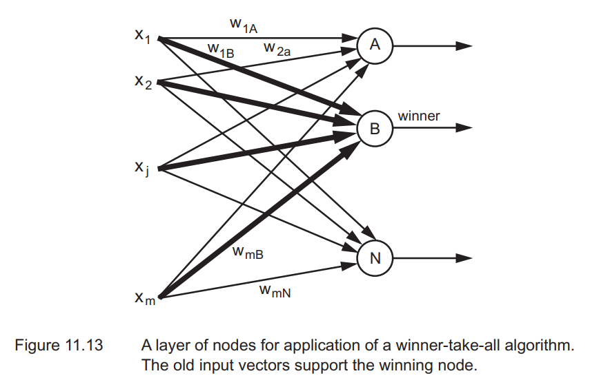
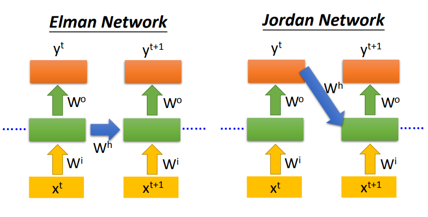
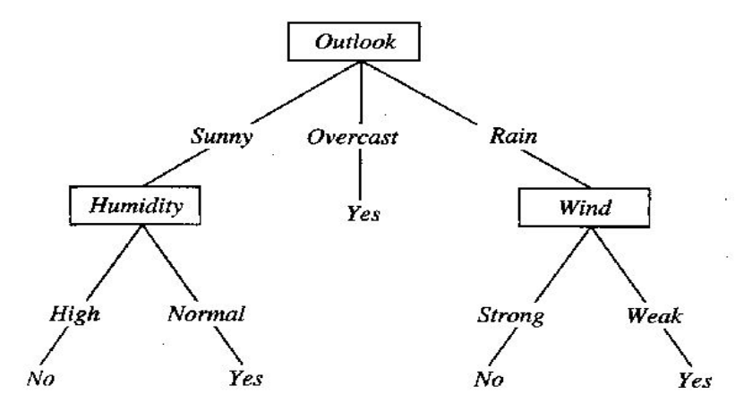
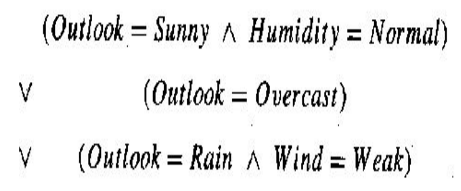
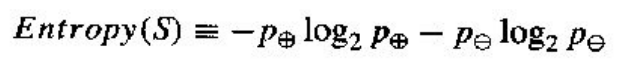
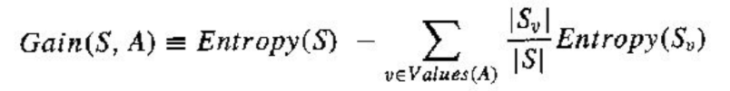
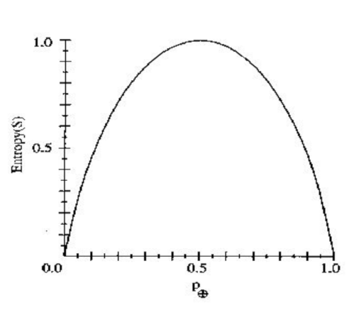
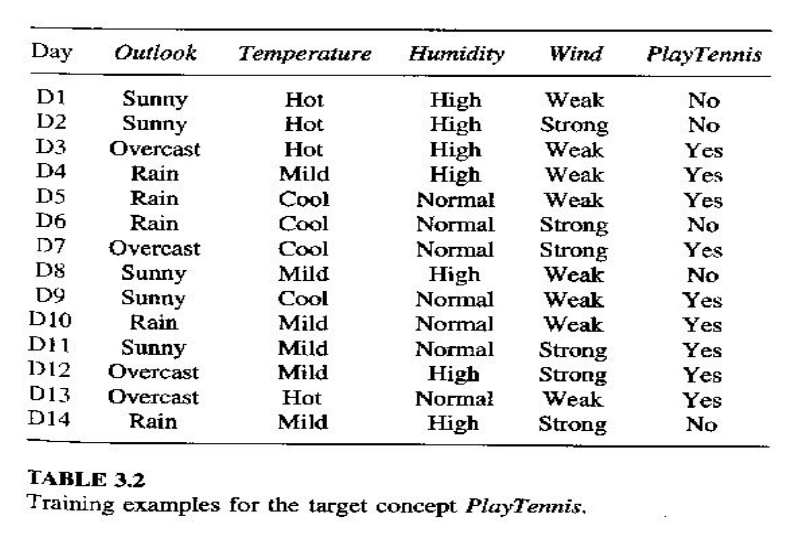
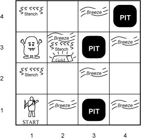

regras
- se aluno não estiver presente mas tiver presença marcada na chamada, leva 2 faltas no lugar de 1
- participação positiva na aula pode facilitar melhora de menção
- é necessário tirar pelo menos 3 pontos em cada prova


4 etapas
1. Busca
2. Representação do Conhecimento
3. Aprendizado de Máquina
4. Tomada de Decisão

pré-treino de IA
treino massivo de dados que prepara um modelo pra funcionamento

18/03/26

GPT      - consulta (teoricamente) de todos os dados
DeepSeek - MoE: Mixture-of-Experts, consulta de "especialistas", entradas de dados mais significativas para o assunto requisitado

LoRA - treinamento secundário da LLM com novos dados, obtidos em um chat por exemplo, para expandir lacunas no repertório. por ex conversar com o ChatGPT pra melhorar sua escrita em português

LLMs nos EUA consomem 1/3 da energia elétrica nacional

a contagem de tokens serve como indicador da abrangência e qualidade de um LLM

> Machine Learning (ML) - aprendizado baseado em dados com mínima intervenção humana

> Aprendizagem supervisionada - monitoramento de um humano, dando feedbacks para o modelo
- problemas de regressão e classificação

> Aprendizagem não supervisionada - 

> Aprendizagem por reforço

> Aprendizagem profunda

23/03

# Busca

agente solucionador de problemas
- busca sequência de ações que leve a estados desejáveis/objetivos

busca: mecanismo universal de solução de problemas
- explora as alternativas sistematicamente
- encontra a sequência de passos para a solução

uma atividade simbólica orientada a objetivo ocorre em um *espaço de problemas*
busca em espaço de problemas é tido como um modelo geral de inteligência

problema em IA é definido em termos de
- espaço de estados possíveis - estado inicial, estado final e demais
- um conjunto de ações/operadores que permitem a transição de estado
- um objetivo (propriedade abstrata ou conjunto de estados finais do mundo)
- uma solução - caminho do estado inicial ao final

uma solução tem um custo, denotando a qualidade da solução

-> árvore representando o espaço de estados possíveis a partir de uma posição inicial
conforme os ramos se estendem, podem ter estados sem ações restantes que não são o final, então é necessário retomar o estado anterior e testar outra ação (backtracking)


> 25/03/26


```
 | |X| | | | |     
X| | | | | | | 
 | | |X| | | | 
 | | | | | | | 
 | | | | | | | 
 | | | | | | | 
 | | | | | | | 
 | | | | | | | 
```

custo de caminho: 
custo de busca:

problemas de estados simples
- o agente sabe
    - em que estado está (mundo totalmente acessível)
    - sabe o efeit de cada ação
- cada ação leva a um único estado
- técnica: busca

problemas de estados múltiplos

problemas contigenciais

problemas exploratórios


algoritmo completo: garantidamente chega à solução
algoritmo ótimo: garantidamente chega à melhor solução (de acordo com um critério)

> aula 30/04/26


### Busca Cega (Exaustiva)
não se sabe qual o melhor nó da fronteira a ser expandido

- busca em largura (BFS) / BFS com custo uniforme
  - algoritmo completo e ótimo (encontra a solução ideal)
  - alto custo de memória

- busca em profundidade
  - nem completo, nem ótimo
  - baixo custo de memória
  - backtracking
  - em casos de múltiplas solução, pode ser vantajosa
  - risco de loop infinito em grafos cíclicos
  - evitar em árvores muito profundas (ou definir limite de profundidade -> **DFS limitada**)

- busca em profundidade limitada
  DFS até dado nível de profundidade, limitando o alcançe a todos os nós de profundidade até o valor definido
- busca em aprofundamento iterativo (iterative deepening)
  testa limites crescrente até encontrar primeira solução

- busca bidirecional
  um dos algoritmos de busca acima partindo do "início" e do "fim" simultaneamente

>[ ] DEVER: pesquisar DFS na Wikipedia - desvantagens, DFS limitada

## Busca Heurística (Informada)
estima qual melhor nó da fronteira a ser expandido com base em funções heurísticas
  - não é completa, não é ótima

função heurística h(n)
- estima o custo do caminho até o nó final

hdd(n) : distância direta entre o nó n e o nó final (não representa o custo para percorrer todo o caminho)

- busca gulosa
  - calcula as distâncias dos seus vizinhos até o nó final (pela função heurística)
  - caso chegue ao fim sem atingir o nó final, volta e tenta achar outro caminho (backtracking)


o que fiz no passado? g(n)
o que fazer no futuro? h(n)

- BFS de custo mínimo "olha o passado"
- busca gulosa (heurística) "olha o futuro"

função de avaliação
f(x) = g(x) + h(x)

- algoritmo A*
  - função heurística se baseia no custo até o nó e a distância dele até o nó final
    partindo do nó A, com vizinhos B, C, D, nó final G
    f(B) = g(B) + h(B) : custo de A->B + distância ideal B->G
  - mesmo custo de memória que a busca gulosa - O(b^d)
  - complea e ótima, como a busca de custo uniforme
  - f é monótona e decrescente
  - best-first search
  - não pode ser paralelisado
  - o ambiente deve ser totalmente conhecido

>[ ] DEVER: comparar busca de custo uniforme, busca gulosa, busca A*

### Heurística admissível
- uma heurística h(n) é admissível se para cada nó n h(n) <= h*(n), onde h*(n) é o custo verdadeiro para alcançar o estado final a partir de n
- uma heurística admissível nunca superestima o custo de alcançar o objetivo, ou seja, é otimista
- teorema: se h(n) é admissível, A* em árvore é ótima

### Consistência (monotonicidade)

### Dominância
uma função heurística h2 é melhor que h1 e muito 

## Busca competitiva
modelagem: estudar jogos

por que estudar jogos?
- engajamento intelectual
- abstração
- representabilidade
- medida de desempenho

---                   | determinístico | sorte
---                   | ---            | ---
informação perfeita   | xadrez, damas, go, othello | gamão, banco imobiliário
informação imperfeita |                | bridge, etc. 

### minimax
maximizar a utilidade (ganho) supondo que o adversário vai tentar minimizá-la

- busca cega em profundidade
- o agente é MAX e o adversário é MIN

passos
- gera a árvore inteira até os estados terminais
- aplica a função de utilidade nas folhas
- propaga os valores subindo a árvore atravéz do minimax - partindo dos nós terminais, se for jogada do adversário, obtém a menor utilidade nos nós possíveis e passa acima; na jogada do agente, calculando a máxima utilidade em seus nós possíveis e passando acima
- determinar qual o valor a ser escolhido por MAX (função de avaliação)

obs
- completo (se a árvore é finita)
- ótimo (contra um oponente ótimo)
- complexidade de tempo O(b^m)
- complexidade de espaço O(bm)

jogo          |escala | algoritmo           | ano
---           | ---   | ---                 | ---
jogo da velha | 3x3   | minimax             | -
xadrez        | 8x8   | minimax, alfa-beta  | 1997
go            | 19x19 | MCTS, AI, MC, RC    | 2016


### poda alfa-beta
assim que a função de avaliação de MAX já tem um valor X (nosso alfa) em um sub-ramo e em outro sub-ramo, um nível abaixo há valores Y, Z, K (possíveis beta), sendo Y <= X. dessa forma, a avaliação nem busca nos outros nós "irmãos" de Y, pois se são maiores que Y, Y é mínimo; se são menores que Y, por transitividade são menores que X e a avaliação MAX vai escolher X de toda forma; portanto, esses ramos que certamente não afetarão o resultado serão "podados", economizando tempo (principalmente, pois O(b^m)) e memória

esse algoritmo foi o primeiro a definitivamente vencer jogadores de xadrez


> 08/04

> 13/04

# Aprendizagem 

## Redes Neurais Artificiais (RNA)

- imita o conceito de redes neurais de animais
- são camadas de nós (unidades de processamento) conectados, com uma direção de fluxo
  - cada nó recebe entradas, faz uma soma ponderada dessas entradas e processa o resultado em uma função, gerando uma saída
  - cada entrada tem um peso respectivo, e o resultado da função é um nível de atividade. se o nível de atividade passa de um limite (threshold), a unidade produz uma determinada resposta de saída
- treinamento: geralmente há uma regra de treinamento, que ajusta os pesos das conexões entre (aprendem através de exemplos) -> "retenção do conhecimento"
  - aprendizagem supervisionada: um "professor" informa uma entrada à RNA, que responde e o professor a compara com o resultado desejado
  - aprendizagem não supervisionada: a saída desejada é obtida através de entradas repetitivas até que a rede retenha o conhecimento, sem saída informada para comparação


### Aprendizagem

equação do erro: \
E = Sd - So
> Sd: saída desejada; So: saída obtida

fator de correção: \
F = c * x * E
> c: taxa de aprendizagem ("porcentagem" de ajuste com base no erro); x: entrada respectiva; E: erro respectiva 

cálculo do novo peso: \
w_novo = w_antigo + F


> obs. se c for 0, a rede nunca vai "aprender"; se for muito pequena, vai demorar para aprender, mas será consistente; se for muito alto, vai ser instável, talvez oscile ao redor dos pesos ideais e pode não convergir


### Arquitetura de RNA
camada de entrada, camadas intermediárias/escondidas, 

### Portas de limiar (curvas)
degrau \
degrau simétrico \
linear \
logística sigmoidal \
tangente sigmoidal


### Perceptrons

mi: taxa de aprendizagem
teta: limiar

vantagens da curva sigmóide como portas de limiar:
- fácil derivação
- fácil linearização (e vice-versa)
- assintótica


> [ ] DEVER: calcular pesos do exemplo de perceptrons (slides 08 IA RNA, p. 37); depois, com taxa de aprendizagem 0.3

w11 = 0,5; w21 = 0,5
x1 = 0, x2 = 0


CoT: Chain of Thought, (?) o modelo usa resultados já obtidos e de sucesso (erro <= taxa ) para avaliar a necessidade de validação dos demais casos 


### Multilayer Perpectrons (MLP)


#### Backpropagation (retropropagação)
como não podemos acessar as camadas internas da RNA, precisamos analisar como minimizar o erro com base apenas nas entradas, na saída que é obtida e a composição de funções que compôem a rede. dessa forma, considerando uma RNA de camada única, derivando a composição de funções para os pesos (individualmente), com base nas entradas e utilizando a regra delta (?), descobrimos que a correção do peso se baseia um produto entre uma constante (arbitrária?), um fator de correção e uma função sobre as entradas

gradiente local / fator de correção

> 22/04

teoricamente, é possível aplicar a retropropragação em uma rede com n camadas intermediárias. porém, praticamente, as limitações da representação numérica de computadores impedem que a aplicação seja correta em todos os casos, pois muitas vezes teremos números menores que 1 se multiplicando (como 0.9^4) a ponto de zerarem um valor por underflow, deixando de ser representável em um double por exemplo. ou números maiores que 1 (como 5^10) se multiplicando até que ocorra um overflow


> [ ] DEVER: leitura do material Neural Networks - A Comprehensive Foundation - Simon Haykin, ch. 4 182-195

"você não é cabelo?" (rede neural para diferenciar uma pessoa cabeluda de uma não cabeluda)
"ele era aluno muito bom. eu falava 1, 2, 3... ele falava como? 4, 5, 6"
"quando eu apontar pra você, te perguntar e você não acertar, não fica chateado. [...] quando a gente sair pela porta, esquece tudo. eu como professor tenho o dever de te chatear um pouquinho [...]"

**Two passes**:
- forward pass começa na camada de entrada; os pesos permanecem constantes, e as entradas são computadas até a saída
- backward pass começa na camada de saída; os erros são propagados para trás, de forma que os erros são atualizos a cada camada

### setup RNA

o setup inicial de uma rede, o conjunto inicial de pesos, muitas vezes pode/deve ser restringido a depender do contexto na qual ela se aplica. tanto para que seja mais fácil ter uma convergência, tanto para agilizar o processo e otimizá-lo

### função de ativação

### taxa de aprendizagem

### condição de parada

duas ideias
- comparar o erro atual com o anterior. se a diferença for menor que uma margem pré-definida, consideramos que o resultado convergiu o suficiente. porém, pode ser que tenha convergido para um resultado não bom o suficiente, distante do desejado
- calcular o erro relativo do resultado atual do desejado. se ele manter um padrão abaixo da margem de erro, o resultado é razoável


## SOM - Self Organizing Map (Kohonen)

separar dados em categorias linearmente separáveis. por exemplo, queremos classificar dados de sardinhas e de salmões, no caso peso e comprimento. queremos que, dado um par (peso, comprimento), nossa RNA determine se é uma sardinha ou um salmão

para isso, usamos uma RNA de camada única, com o mesmo número de categorias que queremos separar e número de perceptrons



## Convolutional Neural Network - CNN

### convolução

stride (int): passo de cada iteração de convolução em uma mesma linha (passo de deslocamento horizontal)

### padding

adição de uma borda de pixels para melhorar o reconhecimento de padrões reconhecido nas extremidades da imagem

### max pooling

comprimir uma matriz mantendo apenas o máximo valor de um bloco menor elementos

por exemplo, se pela convolução obtivemos uma matriz 6x6, podemos aplicar max pooling considerando "sub-matrizes" 2x2

```
padrão:
0 1 0
0 1 0
0 1 0

imagem original     res. convolução     res. max pooling
0 1 1 1 1 0         0 0 1 1 1 0         
0 0 0 0 1 0         0 0 1 1 2 0         0 1 2
0 0 0 0 1 0   ->    0 0 1 1 3 0   ->    0 1 3
0 0 0 0 1 0         0 0 0 0 3 0         0 0 3
0 0 0 0 1 0         0 0 0 0 3 0         
0 0 0 0 1 0         0 0 0 0 2 0         
```

linha 1, coluna 1 da matriz resultante: o máximo entre 0 0 0 0 é 0
linha 2, coluna 3 da matriz resultante: o máximo entre 3 0 3 0 é 3

### flatten / "linearizar" para entradas

### softmax

passar na CNN e gerar um resultado do reconhecimento da imagem


## CNN avançado

obs 1: detectar padrão representativo
podemos definir um padrão que esperamos encontrar na imagem, em geral mais simples que o elemento que queremos identificar na imagem. ex: queremos identificar um pássaro, então definimos um padrão representativo para bicos, considerando que se reconhecemos um bico, temos um potencial pássaro na imagem

obs 2: reutilizar parâmetros
compartilhar parâmetros entre detectores de padrões para diferentes áreas de uma imagem

obs 3: subsampling, comprimir imagem sem perder padrões
barateia o reduz o número de parâmetros para a rede processar a imagem, barateando o processamento


BNF (recursivo)
SWPC-BNF

## RNN - Recurrent Neural Network

### 1-of-N enconding

definimos um léxico (ordenado) para que o sistema diferencie coisas. por exemplo {maçã, bolsa, gato, cachorro, elefante}
então, para cada coisa presente no léxico, ela será representada por um vetor com 0 para

muito simples, mas custo desastroso de memória (matriz n x n, n sendo o número de coisas representadas)

### Beyond 1-of-N enconding


#### Embedding

utilizamos um vetor para representar 

word embedding
image embedding
-> multi model embedding

### Mecanismo de RNN

saídas de camadas escondidas são guardadas para lembrar o contexto, e servem como um novo tipo de entrada

uma rede sem memória não diferencia as sequências de entradas [1 1], [1 1], [2 2] de [1 1], [2 2], [1 1]. mas redes com memória podem apresentar resultados sensíveis à ordem das entradas

> [1 1] [2 2] [1 1]


n3     n4
|   X  |
n1     n2  <-   m1    m2
|   X  |
x1     x2

entradas x1 e x2
nós n1, n2, n3, n4
memórias m1 e m2
n1 recebe x1 e m1
n2 recebe x2 e m2
n3 e n4 recebe saídas de n1 e n2
todos os pesos são 1

### Elman Network vs Jordan Network

**Elman**: os nós de memória são alimentados pelos valores calculados nos nós intermediários \
**Jordan**: os nós de memória são alimentados pelos valores de saída da última iteração



### overview
desvantagens
- gasto de memória
- a retropropagação do gradiente local pode ter over/underflow quando há muitas camadas (multiplicações sucessivas)

# REVISÃO P1

## Problema de IA

o que podemos resolver com IA?
- **jogos**: jogo dos 8 números, 8 rainhas, Jogo da Velha, Go

um problema de IA exige:
- **espaço de estados**: espaço de todos os estados possíveis, considerando as transições possíveis entre estados a partir do ponto inicial
- **solução**: caminho entre estados que levam do estado inicial para o estado desejado/objetivo
- **ações/operadores** que permitem a transição entre estados
- um **objetivo**, sendo uma propriedade abstrata ou concreta que qualifica o estado final

representação do espaço de solução: árvore de estados, com o estado inicial como raiz

uma resolução implica:
- custo de busca (tempo e memória)
- custo de caminho/solução (qualidade) **[pode não existir]**
- custo total = busca + caminho

tipos de problema
dados conhecidos:   | estado atual | efeito das ações |
--                  | --    | --        
estados simples     | X     | X
estados múltiplos 1 |       | X
estados múltiplos 2 |       |
contingencial       |       |
exploratório        |       |

## Busca

algoritmo
- completo: garante que encontra a solução
- ótimo: encontra uma solução ótima

### Busca cega

algoritmos: BFS, DFS, bidirecional

- BFS com custo uniforme: preferência do estado com menor custo de transição
- bidirecional - partindo do estado inicial e final

### Busca heurística

- função de avaliação \
  - função admissível: melhor possível ?

algoritmos: guloso, A*

guloso olha só pra frente \
A* olha pra frente e pra trás/passado

lembrar da função de avaliação do jogo da velha

### Busca competitiva

Minimax
Poda alfa-beta

## Aprendizado de Máquina (não cai na P1)

### Regra de Delta

- cálculo de erro
- fator de correção
- condição de parada
- função de ativação

### MLP - Multi-Layer Perceptron

#### Backpropagation

**two step computation**: sinais propagam para frente, erros propagam para trás

temos camadas ocultas, então precisamos calcular o gradiente local de cada camada e propagar a correção para o perceptron anterior, até chegar na primeira camada de perceptrons

equações 14 e 24


## SOM

mecanismo de competição, aprendizagem competitiva. winner takes all

separação de dados em categorias. atualizamos os pesos para que convirjam para a média de cada categoria

n entradas : n nós : n categorias

## CNN

- convolução
- padding
- max pooling
- flatten


# Tomada de Decisão

abordagens IA
- simbólico: parada há alguns anos
- numérico: em alta, sucesso nas aplicações

cenário: **quero jogar tênis**

## Árvore de decisão

analisar dados de interesse e identificar quais predominam sobre quais





precisamos "medir" informações

### Entropia

podemos definir entropia como um "grau de incerteza" \
`Entropy(S) = -p1 * log2 (p1) - p2 * log2 (p2)`, considerando `S = (p1, p2)`



se S é uma tupla de n probabilidades, teremos n termos `- pi * logn (pi)`, com `1 <= i <= n` e `logn` é o logarítmo na base n

### Ganho

`Gain(S,A) = Entropy(S) - sum[v pertence A](|Sv|/|S| * Entropy(Sv))`



```
se p1 = p2 = 0.5, a entropia é
-2^-1 * log2 (2^-1) - 2^-1 * log2 (2^-1)
2^-1 * log2 (2) + 2^-1 * log2 (2) = 1/2 + 1/2 = 1

se p1 = 1 e p2 = 0
-1 * log2 (1) - 0 * log2 (1) = -1 * 0 - 0 = 0
```

a função de entropia desenha um gráfico similar ao de uma parábola com concavidade pra baixo. as raízes são 0 e 1 e a asbcissa do ponto máximo é 0.5,






wind 14/14
- weak 8/14
  - sim 6/8
  - não 2/8

  `entropy((6/8, 2/8)) = - 6/8 * log2 (6/8) - 2/8 * log2 (2/8) =~ 0,881`

- strong 6/14
  - sim 3/6
  - não 3/6

  `entropy((3/6, 3/6)) = 1`

Gain (S, Wind)

# BERT - Bidirectional encoder representations from transformers

## MLM - Masked Language Model


## Binary Crossentropy

como medir confiabilidade de um modelo treinado?

binary crossentropy é uma função de perda (loss function) para medir a confiabilidade de um modelo de classificação para duas classes (binário)

y: rótulo verdadeiro \
^y: rótulo previsto

o valor real é 0 ou 1. se a previsão do modelo é próxima da realidade, a perda é baixa e confiável; caso contrário, é alta e pouco confiável


fórmula
loss = - [y * log (^y) + (1 - y) * log (1 - ^y)]

na saída, usa a curva de ativação sigmoidal \
é fácil de se implementar e 

## Categorical Crossentropy

função de perda para um modelo de classif icação de 3 ou mais classes


características | binary crossentropy | categorical crossentropy
--              | --                  | --
num classes     | 2                   | 3 ou mais
ativação        | sigmóide            | softmax
soma das prob.  | não precisa ser 1   | 1

# Transformers

## Tokenização

mapeamento de palavras e frases com ID : Token

para linguagens ideogramáticas, é preciso uma etapa de codificação dos ideogramas em "palavras" compreensíveis para o computador


# Abordagem simbólica de IA

## Agentes baseados em conhecimento

### Mundo de Wumpus

o agente é um caçador de tesouros. ele vai partir de uma caverna para encontrar ouro e voltar, mas deve evitar buracos e uma criatura fedorenta: Wumpus

o agente tem 5 sensores:
- fedor (presente em)
- brisa
- luz 



## Características do ambiente

Acessível ou Inacessível (sabemos o estado atual e os possíveis?)
Determinístico ou Não-Determinístico (sabemos quais resultados cada ação implica?)
Episódico ou Não-Episódico
Estático ou Dinâmico
Discreto ou Contínuo

<!-- 
Li Weigang

namkim

Li passou um exercício rapidinho pra formular sentenças em LPO

eu e o colega do meu lado demos um exemplo quase idêntico ao do quadro (nem todo brasileiro gosta de futebol -> nem todo americano gosta de basquete)
li não gostou que repetimos a ideia, descartou (dps entendi q era pq ele queria eleger uma das respostas pra aparecer na prova)

alguns grupos pra frente, alguém também imita a estrutura de outro exemplo, trocando não gostar de corrupção e burocracia por não gostar de fruta e legume. Li fala que tá errado, pq tem que gostar de fruta e legume

outro fala algo sobre não gostar de pregar o dedo, que é ruim. "ah, mas esse é muito estranho! não", rindo

no final, ele pergunta qual foi o melhor exemplo. uma pessoa fala que é o de pregar o dedo. ele discorda pq é muito estranho

esse cara é engraçado. a aula foi meio freestyle, n ajudou tanto quem não fez lógica, LC1 ou não lembra muito de FTC. achei bem cômico como o critério de validade dos exemplos variava: uma hora, a ideia era ser sempre verdadeiro para a estrutura real do mundo; outra, era o moral e certo. nunca foi se a frase era bem formada ou não, faltou contexto
-->

### Tipos de raciocínio

- Dedução: aplicação de regras de inferênicas sobre fatos -> novos fatos
- Abdução: aplicação inversa de regras de inferência sobre fatos -> novos fatos
- Indução: parte-se dos fatos para generalizar regras
- Analogia: aplicação sobre regras de adaptação sobre casos


### Modelagem lógica

Base do conhecimento
- sentenças representando as percepções do agente
- sentenças válidas implicadas a partir das sentenças das percepções
- regras de inferência

para o agente do mundo de Wumpus...
- os fatos são as constatações que ele faz pelos sensores e pela posição que ele ocupa no mapa
- as regras de inferência são as formas que ele pode obter novos fatos sobre o mapa a partir dos fatos já considerados

considerando regras de inferência que permitam o agente concluir ou supor onde tem um buraco, onde está Wumpus e quais casas são seguras, ele é capaz de descobrir o que há em cada casa do mapa. no melhor dos casos, poderá fazer isso sem cair em buracos ou encontrar Wumpus

### Explorando o mundo de Wumpus

legenda de sentenças: \
~a : negação de a \
a e b: conjunção de a e b \
a ou b: disjunlão de a e b \
a -> b: a implica b \
X(x, y): objeto O ocupa a posição (x, y) do mapa (x coluna, y linha) \
s(x, y): sensor s positivo na posição (x, y)

ações: \
av: avança na direção que o agente aponta \
gira(l|r): gira 90º para esquerda ou direita \
pega: pega objeto na mesma posição que o agente \
at: atira flecha na direção que o agente aponta \
sai: o agente sai da caverna (por onde entrou)

objetos: \
A: agente \
O: ouro \
B: buraco

sensores (e regras do mundo de Wumpus): \
f: fedor - RW1: casa de Wumpus e adjacentes \
b: brisa - RW2: casa de buraco e adjacentes \
c: choque - RW3: posição bloqueada, parede \
l: luz do ouro - RW4: casa do ouro \
g: grito de Wumpus - RW5: casa de Wumpus

regras de inferência: \
modus ponens \
E-eliminação \
E-introdução \
Ou-introdução \
Eliminação da dupla negação \
Resolução unidade

regras de inferência e regras de sensores: \
s(x, y): s(x, y) ou s(x-1, y) ou s(x, y-1) ou s(x+1, y) ou s(x, y+1) \
~s(x, y): ~s(x, y) e ~s(x-1, y) e ~s(x, y-1) e ~s(x+1, y) e ~s(x, y+1)

situação do mundo: \


fixo: W(1, 3), O(2, 3), B(3, 1), B(3, 3), B(4, 4) \
inicial: A(1, 1), agente aponta para a direita

agente      | ação    | sensores  | regras aplicadas  | novos fatos                                           | base de conhecimento (sentenças atômicas)
--          | --      | --        | --                | --                                                    | --
A(1, 1), r  |         | ~f(1, 1)  | Mod. Ponens, RW1  | ~W(1, 1) e ~W(2, 1) e ~W(1, 2)                        | {}
A(1, 1), r  |         |           | E-eliminação x3   | ~W(1, 1), ~W(2, 1), ~W(1, 2)                          | {~W(1, 1), ~W(2, 1), ~W(1, 2)}
A(1, 1), r  |         | ~b(1, 1)  | Mod. Ponens, RW2  | ~B(1, 1) e ~B(2, 1) e ~B(1, 2)                        | {~W(1, 1), ~W(2, 1), ~W(1, 2)}
A(1, 1), r  |         |           | E-eliminação x3   | ~B(1, 1), ~B(2, 1), ~B(1, 2)                          | {~W(1, 1), ~W(2, 1), ~W(1, 2), ~B(1, 1), ~B(2, 1), ~B(1, 2)}
A(2, 1), r  | av      | ~f(2, 1)  | Mod. Ponens, RW1  | ~W(2, 2) e ~W(1, 1) e ~W(2, 1) e ~W(3, 1)             | {~W(1, 1), ~W(2, 1), ~W(1, 2), ~B(1, 1), ~B(2, 1), ~B(1, 2)}
A(2, 1), r  |         |           | E-eliminação x3   | ~W(2, 2), ~W(1, 1), ~W(2, 1), ~W(3, 1)                | {~W(1, 1), ~W(2, 1), ~W(1, 2), ~B(1, 1), ~B(2, 1), ~B(1, 2), ~W(3, 1), ~W(2, 2)}
A(2, 1), r  |         | b(2, 1)   | Mod. Ponens, RW2  | B(2, 2) ou B(1, 1) ou B(2, 1) ou B(3, 1)              | {~W(1, 1), ~W(2, 1), ~W(1, 2), ~B(1, 1), ~B(2, 1), ~B(1, 2), ~W(3, 1), ~W(2, 2)}
A(2, 1), r  |         |           | Ou-eliminação x2  | B(2, 2) ou B(3, 1)                                    | {~W(1, 1), ~W(2, 1), ~W(1, 2), ~B(1, 1), ~B(2, 1), ~B(1, 2), ~W(3, 1), ~W(2, 2)}
A(2, 1), u  | gira(l) |           |                   |                                                       | {~W(1, 1), ~W(2, 1), ~W(1, 2), ~B(1, 1), ~B(2, 1), ~B(1, 2), ~W(3, 1), ~W(2, 2)}
A(2, 1), l  | gira(l) |           |                   |                                                       | {~W(1, 1), ~W(2, 1), ~W(1, 2), ~B(1, 1), ~B(2, 1), ~B(1, 2), ~W(3, 1), ~W(2, 2)}
A(1, 1), l  | av      |           |                   |                                                       | {~W(1, 1), ~W(2, 1), ~W(1, 2), ~B(1, 1), ~B(2, 1), ~B(1, 2), ~W(3, 1), ~W(2, 2)}
A(1, 1), u  | gira(r) |           |                   |                                                       | {~W(1, 1), ~W(2, 1), ~W(1, 2), ~B(1, 1), ~B(2, 1), ~B(1, 2), ~W(3, 1), ~W(2, 2)}
A(1, 2), u  | av      | f(1, 2)   | Mod. Ponens, RW1  | W(1, 3) ou W(1, 2) ou W(2, 2) ou W(1, 1)              | {~W(1, 1), ~W(2, 1), ~W(1, 2), ~B(1, 1), ~B(2, 1), ~B(1, 2), ~W(3, 1), ~W(2, 2)}
A(1, 2), u  |         |           | Ou-eliminação x3  | W(1, 3)                                               | {~W(1, 1), ~W(2, 1), ~W(1, 2), ~B(1, 1), ~B(2, 1), ~B(1, 2), ~W(3, 1), ~W(2, 2), W(1, 3)}
...         | ...     | ...       | ...               | ...                                                   | {...}


## Lógica de Predicados (de 1ª Ordem)

termos: constantes e variáveis \

funções: tomam n termos e são avaliadas para apenas um termo, sendo n inteiro tal que 0 <= n \

predicados: tomam uma sentença e são avaliadas para um valor de verdade (verdadeiro, falso) \

sentenças: atômicas ou complexas
- atômicas: formadas por apenas 1 predicado
- complexas: formadas por predicados unidos por conectivos (operadores)

conectivos:
- negação: não A
- conjunção: A e B
- disjunção: A ou B
- implicação: se A, então B
- bi-implicação / equivalência: A = B, (A e B) ou (não A e não B)

quantificadores:
- universal: Ax, para todo x; x assume todo termo
- existencial: Ex, existe x; x assume um termo

Ax (Rx -> Vx) dado que Rx: x respira, Vx: x é vivo
Ax (Rx -> Vx) =||= ~Ex ~(Rx -> Vx) =||= ~Ex (Rx e ~Vx)


"LPO não faz engajamentos ontológicos para coisas como tempo, categorias, e eventos"

## Conteúdos P2

- RNN
- Árvore de decisão
- BERT
  - Classificação Binária
  - CrossEntropy
- Lógica proposicional
- Lógica de predicados de primeira ordem
- Leis de De Morgan
- Prolog

# Métricas de avaliação de Machine Learning

Contexto: classificação binária de elementos, positivo e negativo

Precisão/Precision:
$$\frac{tp}{tp+fp}$$

Revocação/Recall:
$$\frac{tp}{tp+fn}$$

Acurácia/Accuracy:
$$\frac{tp+tn}{tp+tn+fp+fn}=\frac{tp+tn}{total}$$

# Prolog

utilizado em sistemas: Baseados em Conhecimento, Banco de Dados, Sistemas Especialistas, PLN

exercício: definir regra de neto

progenitor: X gerou Y
filho: X é gerado por Y
avô: X é avô de Y, X é filho de Z e Z é filho de Y

```prolog
% fatos
progenitor(a, b).
progenitor(a, c).
progenitor(b, d).
progenitor(e, d).

% regras
filho(X, Y) :- progenitor(Y, X).

avô(X, Y) :- filho(Y, Z), progenitor(X, Z).

% questões
?- progenitor(a, X).  % > %   X = b; X = c;
?- filho(X, a).       % > %   X = b; X = c;
?- avô(X, d).         % > %   X = a;
```
