# Tutorial e dicas para desenvolvimento Quartus - FPGA

## Sobre este texto

Esse texto é uma adaptação e atualização do *Tutorial de uso do Quartus-Prime v2.2* do professor Marcus Vinicius Lamar. O foco é abordar detalhes e problemas que surgiram desde a escrita do tutorial ou que não são tratados nele. \
Caso a resposta para seu problema ou dúvida não esteja aqui, **leia o tutorial** do Lamar, ele é bem detalhado e completo, pode ser que ajude.

Se tiver alguma dúvida ou sugestão para este arquivo, por favor entre em contato pela monitoria ou me mande mensagem pelo Teams. \
Posso fazer uma sessão FAQ depois aqui com dúvidas comuns.

Escrito por Giovanni Daldegan.

<!-- 
## Índice
1. [Setup Quartus + ModelSim](#setup-quartus--modelsim)
    1. [Setup Quartus + ModelSim](#setup-quartus--modelsim)
    1. [Setup Quartus + ModelSim](#setup-quartus--modelsim)
1.
-->

## Setup Quartus & ModelSim

Componentes necessários (mínimo para OAC):
- Quartus Prime Lite Edition
- Questa*-Altera FPGA and Starter Editions
- Cyclone V device support
- MAX 10 FPGA device support (não tenho certeza se é necessário, mas de toda forma é bem pequeno)

### Instalação Quartus ([Windows](https://www.altera.com/downloads/fpga-development-tools/quartus-prime-lite-edition-design-software-version-25-1-windows), [Linux](https://www.altera.com/downloads/fpga-development-tools/quartus-prime-lite-edition-design-software-version-25-1-linux))

- Instalador (recomendado)
    1. Baixe o instalador personalizado
    
    1. Selecione os componentes listados [acima](#setup-quartus--modelsim)
    
    1. Inicie o download e instalação dos componentes (reserve um bom tempo, demora um bocadinho)

    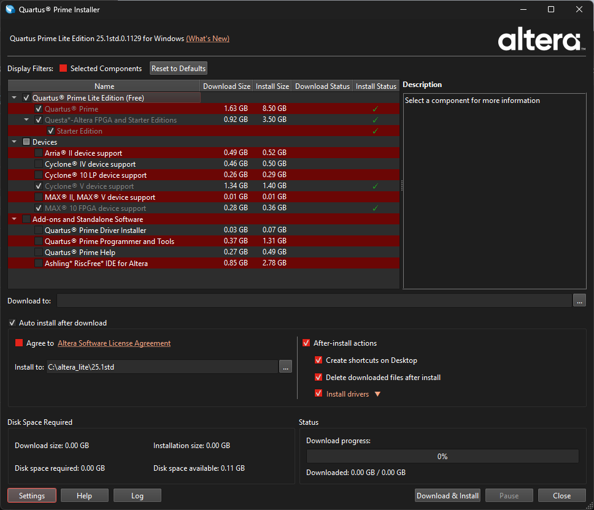

- Manual
    1. Baixar, **na mesma pasta**, os [componentes listados](#setup-quartus--modelsim)

    1. Com todos instaladores e suportes de dispositivos na mesma pasta temporária:
        - Instalar Quartus Prime
        - Instalar Questa*-Altera FPGA and Starter Editions

- Completo (download 6.5 GB, espaço necessário 31.37 GB)
    1. Baixar o instalador completo (Quartus + Questa-Altera FPGA + suportes para dispositivos)

    1. Instalar

Altera Download Center - Quartus Prime Lite: \
https://www.altera.com/downloads/fpga-development-tools/quartus-prime-pro-edition-design-software-version-26-1-windows

#### Possíveis falhas na instalação

É possível que o instalador tenha problemas para estabelecer uma conexão com a internet. Se o problema persistir, pode ser melhor instalar os proramas individualmente (ou a versão completa). \
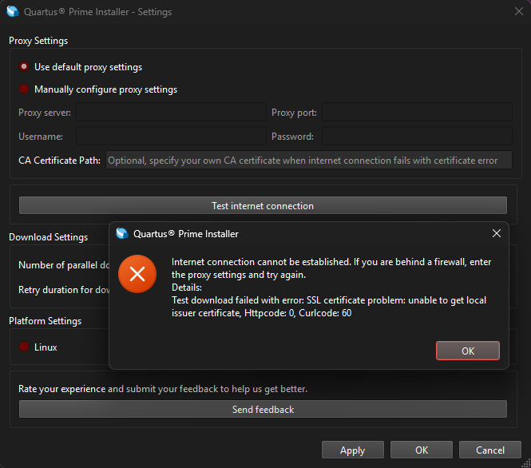

### Instalação ModelSim ([Windows/Linux](https://www.altera.com/downloads/simulation-tools/modelsim-fpgas-standard-edition-software-version-20-1-1))
Baixar e instalar ModelSim-FPGA Edition.

Altera Download Center - ModelSim
https://www.altera.com/downloads/simulation-tools/modelsim-fpgas-standard-edition-software-version-20-1-1

### Setup adicional

#### Obtenção da licença

Para realizar as simulações do Quartus, é necessário obter uma **licença da Altera**. É possível obtê-la gratuitamente pelo Quartus acessando:
1. Tools > License Setup \
    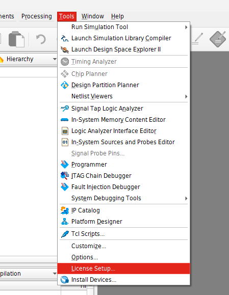
1. Clique no botão "Get no-cost License"
1. Selecione a licença Questa*-Altera FPGA Starter Edition (SW-QUESTA) e clique OK
1. Marque a opção "Use LM_LICENSE_FILE variable"

    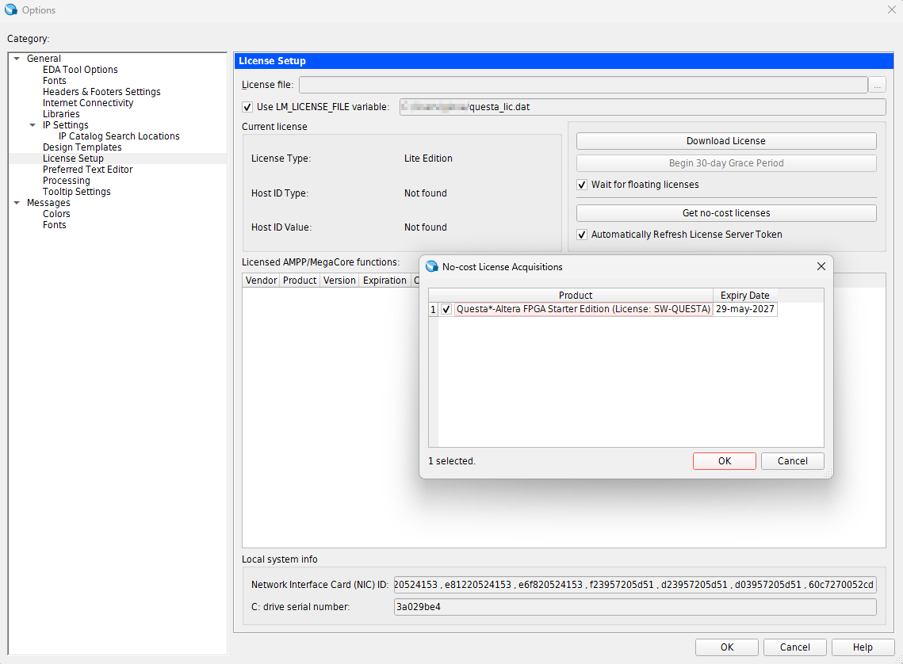

O programa deve baixar a licença no diretório base do seu usuário no seu SO. \
Para Windows, creio que o caminho padrão é `C:/Users/<seu_usuário>/questa_lic.dat`.

#### Definição das variáveis de ambiente

Por fim, deve-se garantir que as variáveis de ambiente da sua licença Altera estão definidas e apontam para ela.

Localize sua licença, copie o caminho do arquivo e defina-o como valor das seguintes variáveis. Por precaução, eu defino todas as seguintes variáveis:
- `LM_LICENSE_FILE`
- `SALT_LICENSE_SERVER`
- `SALT_LICENSE_FILE`

Exemplo no Windows: \

Exemplo de erro na simulação por variável não definida (`SALT_LICENSE_SERVER`): \
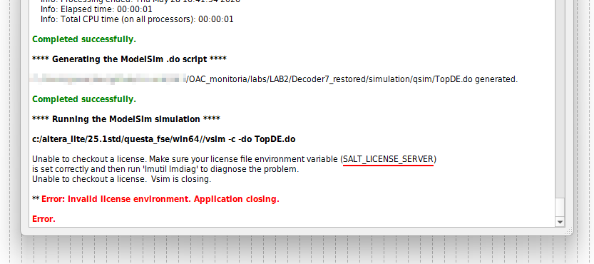

> [!note]
> Acredito que `LM_LICENSE_FILE` é essencial para o Quartus Prime 24.1 e `SALT_LICENSE_SERVER` pro 25.1. Como teve um rebranding de Intel &rarr; Altera nesses tempos, devem ter mudado alguns detalhes de licença e do software. Parece que introduziram algumas inconsistências depois dessa mudança.

## Desenvolvimento em HDL - Verilog

[em desenvolvimento]

## Compilação do design - Quartus

1. Selecione o arquivo correto como Top-Level \
    Na seção Project Navigator, selecione a aba Files. Clique com o botão direito sobre o arquivo e selecione a opção "Set as Top-Level Entity".

    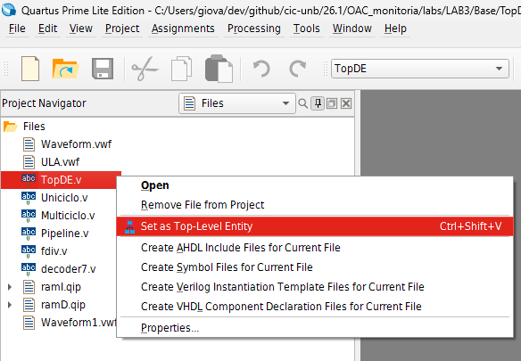

1. Analise os recursos físicos \
    Anote os valores mostrados no Flow Summary depois da compilação:
    - Total de ALMs 
    - Total de registradores
    - Número de bits usados
    - Número de blocos DPS

    

1. Analise os recursos temporais

    1. Tools > Timing Analyzer \
        

    1. Na janela aberta, na seção "Tasks" à esquerda, clique duas vezes nas opções "Create Timing Netlist", depois em "Report FMax Summary" \
        Anote a **frequência máxima** para o design. Arredonde esse valor para baixo e use-o pra calcular o **perído mínimo de clock** que o design aguenta.

        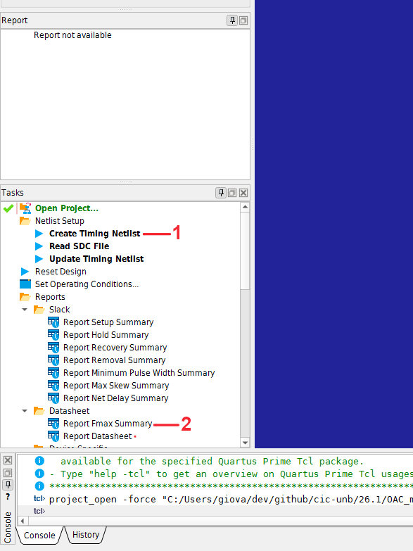
    
    1. Caso, seu projeto seja síncrono (utilize clock) crie um clock. Vá em Constraints > Create Clock \
        1. Dê um nome para o clock
        1. Insira o período mínimo de clock calculado anteriormente
        Se estiver usando o processador RISC-V pronto, ele já tem clocks definidos, não precisa criar outro. <!-- TODO: checar se é isso mesmo -->

    1. Clique duas vezes na opção "Report Datasheet"

        Na seção "Report" também à esquerda, visualize as tabelas e anote:
        - Setup Times (**tsu**) anote o menor valor 
        - Hold Times (**th**)
        - Clock to Output Times (**tco**). \
        - Propagation delay.

        A tabela de tsu **deve** ter valores negativos, enquanto as tabelas de th, tco e tpd devem ter valores positivos. Se não seguir essa regra, quer dizer que o período de clock definido é curto demais e a execução terá hazards.
    

## Simulação - Quartus

## Simulação - FPGA DE1-SoC (Cyclone V)

### Carregar design na placa

Com um design compilado e um arquivo `.sof` correspondente na pasta `output_files`, é possível carregar o hardware simulado na placa FPGA.

1. Acesse Tools > Programmer

1. Selecione placa, clicando em "Hardware Setup" e, em "Currently selected hardware", escolha a DE-SoC \
    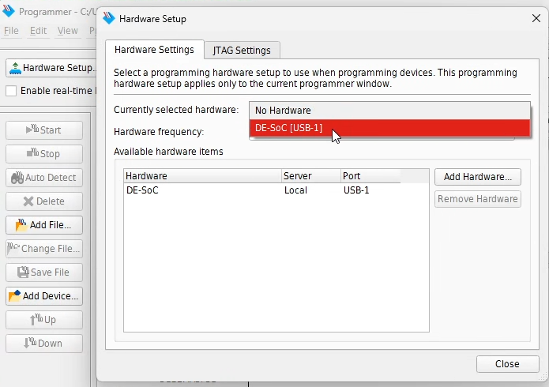

1. Voltando ao menu Programmer, clique em "Auto Detect" e selecione 5CSEMA5 \
    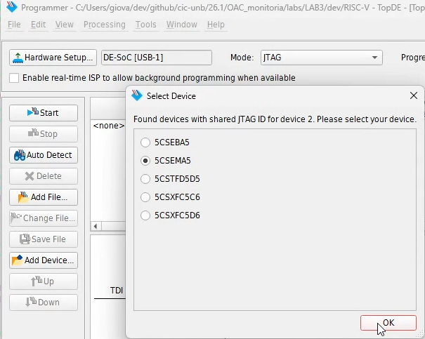

1. Clique "Yes" no aviso que surgir

1. Selecione o dispositivo 5CSEMA5, clique em "Change file..." \
    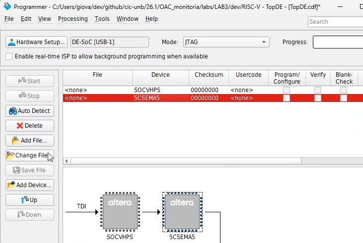

1. Selecione o design compilado `output_files/<seu_design>.sof` \
    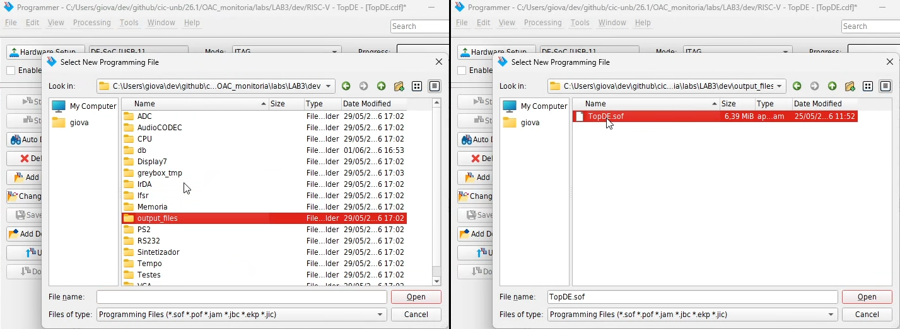

1. No despositivo com nome do seu arquivo `.sof`, presente na tabela, marque a opção "Program/Configure"

1. Aperte o botão Start e espere carregar na placa
    A placa vai acender um led verde até o design estar totalmente carregado.

Ao final do processo, a tela do Programmer deve estar assim e o seu design já está rodando na placa:

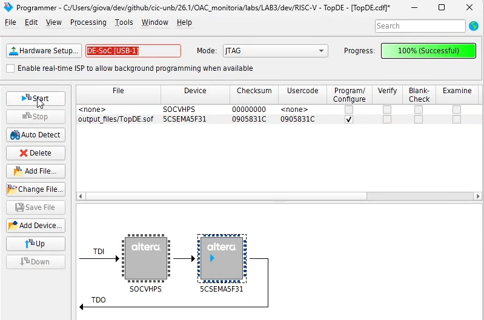

<!--
### Funções do processador RISC-V 24.1 (interface FPGA)

Caso esteja carregando o processador RISC-V 24.1 na placa, essas são algumas funções dele.

SW[5] \
    0 endereço \
    1 instrução

...

Frequência

caso SW[4:0] = 5'b00000
- freq = 50 MHz / 256

senão
- 50 MHz / (SW[4:0])
- varia de 50 MHz (5'b00001) até 50 / 31 = 1,61 MHz (5'b11111)

Display 7 segmentos
S[]

-->

### Editar memória da placa

1. Tools > In-System Content Editor

1. `F5` mostra a memória carregada na placa \
    Caso não apareçam as unidades de memória de dados e programa, feche a janela e abra novamente (chance do Quartus travar).

    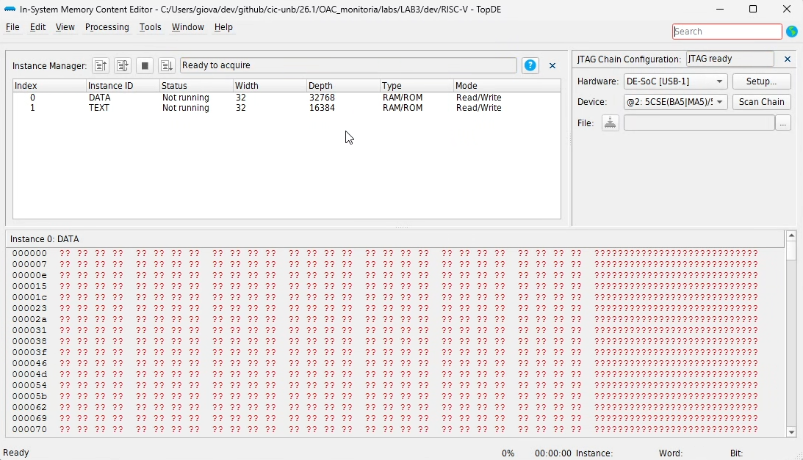

1. Selecione a unidade de memória (DATA, TEXT), clique com o botão direito e Import Data From File \
    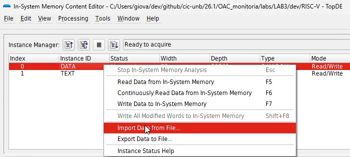

1. Selecione o arquivo `.mif` correspondente à unidade a ser reescrita (dados ou programa) \
    Lembre-se de selecionar o tipo correto de arquivo na opção "Files of Type", por padrão o explorador procura por arquivos `.hex` \
    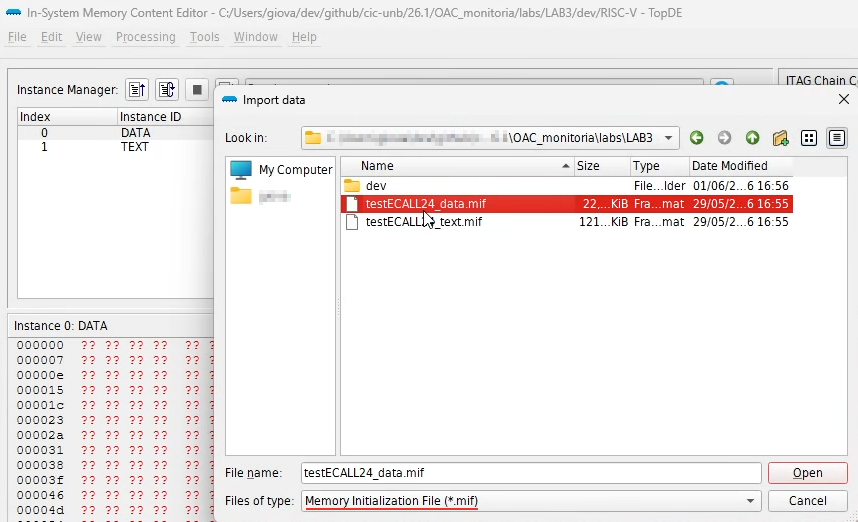

1. `F7` carrega a memória selecionada e sobrescreve na placa, reiniciando a execução na placa

# Referências

**M. V. LAMAR**. *Tutorial de uso do Quartus-Prime v2.2*.