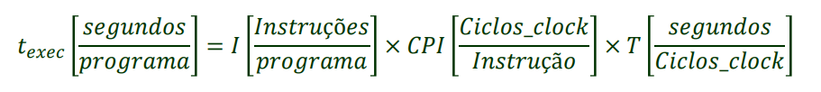
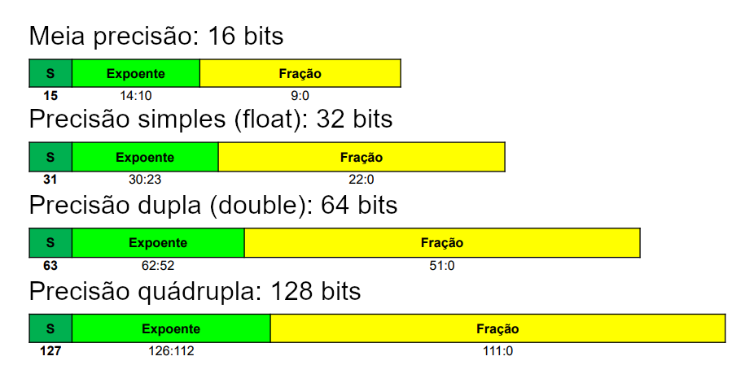
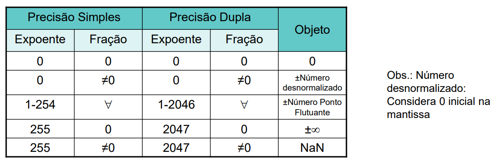
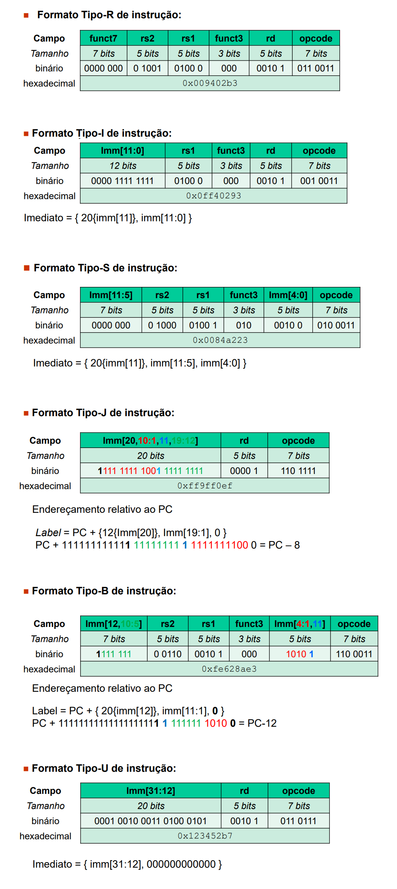
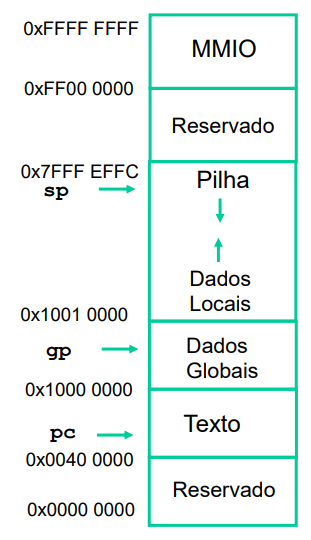
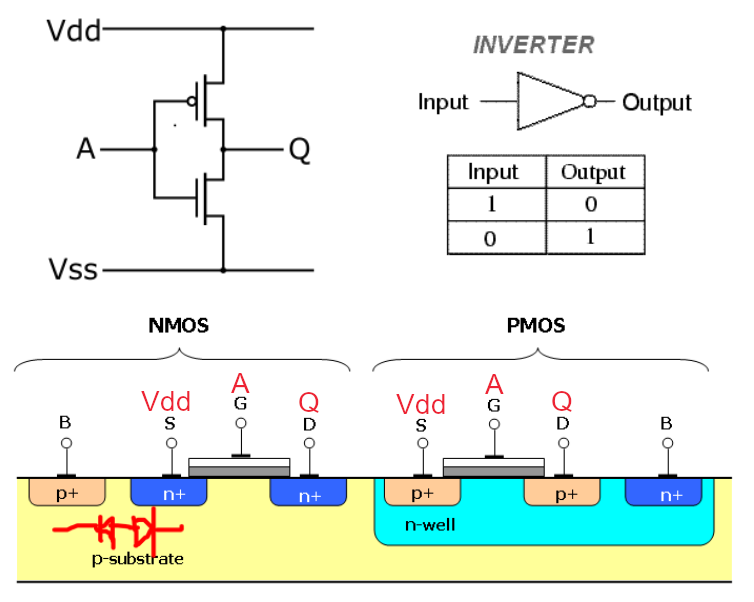
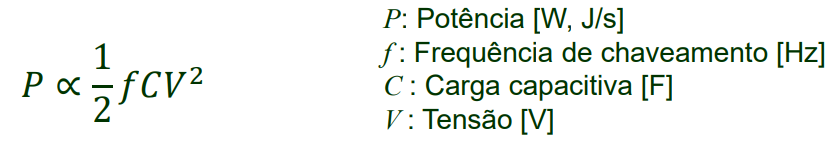

assuntos da P1
- fórmula de tempo de execução, comparação de desempenho
- relação frequência <-> tempo de clock (potências de 10 e prefixos)
- programação assembly
  - manipulação de float
  - manipulação de vetores
  - acesso à memória
- decompilação assembly
  - tipos de instrução
  - endereçamento


## desempenho



**benchmark**: programas de teste de processamento, programas de alto-nível padronizados e feitos para serem reproduzidos em diferentes máquinas \
**workload**: instruções que o processador realmente vai executar

### comparação de máquinas

- média aritmética
- média ponderada: os pesos são a probabilidade de ocorrência de um programa


## representação int e float

conversões - complemento de 2

opostos:
comp2    | decimal |    | comp2 invertido | comp2 invertido +1  | decimal
--       | --      | -- | --              | --                  | --
01001101 | 77      |    | 10110010        | 10110011            | -77
10010010 | -110    | -> | 01101101        | 01101110            | 110
01010010 | 82      |    | 10101101        | 10101110            | -82
11111111 | -1      |    | 00000000        | 00000001            | 1

```
3 2 1 0
a b c d (comp2)

- a * 2^3 + b * 2^2 + c * 2^1 + d
```





### overflow/underflow

ocorre quando o resultado de uma operação não pode ser representado na mesma forma que os operandos

em complemento de 2, o overflow pode ocorrer quando **somamos números de mesmo sinal** ou **subtraímos números de sinais opostos**



## potências de 10 e prefixos

1 MHz = 1 * 10^6 ciclo/s \
1 s / 10^6 = 1 μs = 10^-6  \
1 GHz = 1 * 10^9 ciclo/s \
1 s / 10^9 = 1 ns = 1 * 10^-9 s

freq | período
--   | --
KHz  | ms
MHz  | μs
GHz  | ns
THz  | ps


## Memory Mapped I/O (MMIO)




## decompilação assembly
1. converter hexa -> bin
2. identificar instrução pelo opcode na tabela e possivelmente funct3 e funct7
3. identificar registradores (xN)
4. montar imediato (se tiver)
5. escrever a instrução
6. interpretar endereços (jumps e branchs)

```
0x00b50c63
0000 0000 1011 0101 0000 1100 0110 0011

opcode: 110 0011, 63  ->  tipo-B

imm[12, 10:5] | rs2    | rs1    | funct3 | imm[4:1, 11] | opcode
0000 000      | 0 1011 | 0101 0 | 000    | 1100 0       | 110 0011

funct3: 0
rs1: 01010, 10        ->  x10, a0
rs2: 01011, 11        ->  x11, a1
imm: 0 0 000000 1100 0  ->  8 + 16 = 24
```

## transistor



