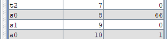
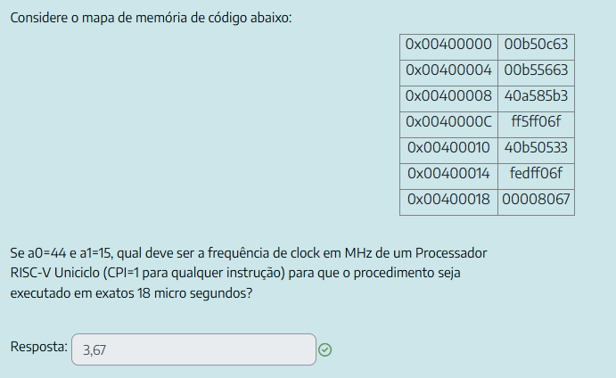
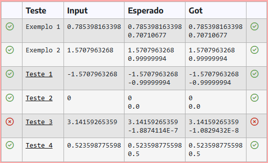

## questão 1

a resposta em RISC-V comentada tá nesse arquivo [programa questão 1](./src/p1_q1.asm)

>[!NOTE]
> eu converto os tabs de identação em espaços pra formatação ficar bonitinha no GitHub e em outras
> IDEs, então se forem editar o código saibam que o comportamento do cursor de texto vai ficar um
> pouco estranho no RARS

## questão 2

addr        | instr     | assembly
--          | --        | --
0x00400000  | 00b50c63  | `beq a0, a1, 24`
0x00400004  | 00b55663  | `bge a0, a1, 12`
0x00400008  | 40a585b3  | `sub a1, a1, a0`
0x0040000C  | ff5ff06f  | `jal zero, -12`
0x00400010  | 40b50533  | `sub a0, a0, a1`
0x00400014  | fedff06f  | `jal zero, -20`
0x00400018  | 00008067  | `jalr zero, ra, 0`

na minha sessão da prova, `a0 = 45`, `a1 = 15` e `t_exec = 18 μs`

a contagem de instruções do procedimento pode ser feita na mão (já que markdown não é papel, fiz essa tabelinha)

a0  | a1    | conta         | contagem instr    | contagem acumulada
--  | --    | --            | --                | --
44  | 15    | 44 - 15 = 29  | 4                 | 4
29  | 15    | 29 - 15 = 14  | 4                 | 8
14  | 15    | 15 - 14 = 1   | 4                 | 12
14  | 1     | 14 - 1 = 13   | 4                 | 16
13  | 1     | 13 - 1 = 12   | 4                 | 20
12  | 1     | 12 - 1 = 11   | 4                 | 24
... | ...   | ...           | 36 (9 omitidas)   | 60
2   | 1     | 2 - 1 = 1     | 4                 | 64
1   | 1     | (exit)        | 2 (beq e jal)     | 66

Note que, em cada iteração do programa:
- quando a0 > a1, `beq`, `bge` (pulo tomado), `sub` `jal` são executadas (4 instr)
- quando a0 < a1, `beq`, `bge` (pulo não tomado), `sub` `jal` são executadas (também 4 instr)

mas também dá pra fazer pelo RARS \
**chequem o programa da [questão 2 descompilada](./src/p1_q2.asm)**. é mais fácil fazer essa contagem de instruções pelo registrador de status e controle `3074`, usando a instrução `csrr` para salvar essa contagem no nosso programa

o resultado é o mesmo da tabela acima \

daí, basta jogar na fórmula

t_exec: 18 * 10 ^-3 (no meu caso) \
I: 66 \
CPI: 1

$$
t_{exec} = I * CPI * T
$$
$$
18 * 10^{-6} = 66 * 1 * T
$$
$$
T = \frac{18}{10^{-6}*66}
$$

$$
T = 2,727272... * 10^{-7}
$$
$$
freq = \frac{1}{T} = \frac{1}{2,727272... * 10^{-7}} = 3666666.666...
$$
$$
freq \approx 3,67 * 10^{6}
$$

se o período de clock é de 0,2727272... μs, então a frequência é de 3.666.666,666 Hz, ou aproximadamente 3,67 MHz

## questão 3

[ainda vou escrever a explicação dela]

[questão 3 (precisão simples)](./src/p1_q3_float.asm) \
[questão 3 (precisão dupla)](./src/p1_q3_double.asm) (só uma curiosidade mesmo)

a implementação no Aprender3 salva $x^2$ e calcula ${x}^{2n+1}$ multiplicando a potência calculada na última iteração e esse valor salvo. essa implementação dá `-1.8874114E-7` no Teste 3 (seno(3.14159265359))

mas se, no lugar disso, a gente obter ${x}^{2n+1}$ multiplcando a potência anterior por $x$ duas vezes, o resultado desse teste sai `-1.0829432E-8`. matematicamente, o resultado é o mesmo, mas a imprecisão de float dá essa divergência \
essa diferença não deve ser penalizada na nota da prova. se perderam ponto e o Lamar não corrigir, depois falem com ele

resultado da segunda implementação, sem usar o valor de $x^2$ pra calcular a potência de cada iteração: \

