# Tutorial para desenvolvimento com Quartus + FPGA

<!-- 
TODO:
- análise de requisitos temporais (tempos dos processadores RISC-V 24.1)
- seção simulação Quartus + troubleshooting
- problema -voptargs="+acc" no Quartus 24.1

extra
- projeto para teste de instalação do Quartus com exemplos de Verilog (com comentários didáticos para codificação e simulação)
- testar Quartus+FPGA nos PCs do LINF1
- link para texto mais detalhado e abrangente de orientações e troubleshooting (recursos da UnB, computadores do LINF, versões específicas do Quartus, conflitos com SOs específicos, etc.)

- artefatos de teste de entregas de OAC
    - programas (em RISC-V) de teste de processador RISC-V
      - estado inicial dos módulos
        - mostra o estado inicial do banco de dados adicionando x0 a cada registrador e apresentando o resultado (apresentar como? exigir estrutura de apresentação do design testado?)
        - leitura das primeiras n words de uma das memórias (input * 4)
        - teste de todos imediatos

      - teste de temporização adequada. casos de borda
-->

## Índice <!-- omit from toc -->

- [Tutorial para desenvolvimento com Quartus + FPGA](#tutorial-para-desenvolvimento-com-quartus--fpga)
    - [Sobre este texto](#sobre-este-texto)
    - [Setup Quartus \& ModelSim](#setup-quartus--modelsim)
        - [Instalação Quartus (Windows, Linux)](#instalação-quartus-windows-linux)
            - [Possíveis falhas na instalação](#possíveis-falhas-na-instalação)
        - [Instalação ModelSim (Windows/Linux)](#instalação-modelsim-windowslinux)
        - [Setup adicional](#setup-adicional)
            - [Obtenção da licença](#obtenção-da-licença)
            - [Definição das variáveis de ambiente](#definição-das-variáveis-de-ambiente)
    - [Desenvolvimento em HDL - Verilog](#desenvolvimento-em-hdl---verilog)
    - [Compilação do design - Quartus](#compilação-do-design---quartus)
        - [Análise dos requisitos físicos](#análise-dos-requisitos-físicos)
        - [Análise dos requisitos temporais](#análise-dos-requisitos-temporais)
    - [Simulação - Quartus](#simulação---quartus)
    - [Execução - FPGA DE1-SoC (Cyclone V)](#execução---fpga-de1-soc-cyclone-v)
        - [Carregar design na placa](#carregar-design-na-placa)
        - [Gerar arquivos de inicialização de memória](#gerar-arquivos-de-inicialização-de-memória)
        - [Criar unidades de memória no Quartus](#criar-unidades-de-memória-no-quartus)
        - [Editar memória da placa](#editar-memória-da-placa)
- [Referências](#referências)

## Sobre este texto

Esse texto é uma adaptação e atualização do *Tutorial de uso do Quartus-Prime v2.2* do professor Marcus Vinicius Lamar. O foco é abordar detalhes e problemas que surgiram desde a escrita do tutorial ou que não são tratados nele. \
Caso a resposta para seu problema ou dúvida não esteja aqui, **leia o tutorial** do Lamar, ele é bem detalhado e completo, pode ser que ajude.

Se tiver alguma dúvida ou sugestão para este arquivo, por favor entre em contato pela monitoria ou me mande mensagem pelo Teams. \
Posso fazer uma sessão FAQ depois aqui com dúvidas comuns.

Escrito por Giovanni Daldegan.

## Setup Quartus & ModelSim

Componentes necessários (mínimo para OAC):

- Quartus 25.1:
    - Quartus Prime Lite Edition 25.1
    - Questa*-Altera FPGA and Starter Editions 25.1
    - Cyclone V device support (25.1)
    - MAX 10 FPGA device support (25.1)

- ModelSim 20.1

Reserve pelo menos 20 GB para o download e instalação dos programas. Se estiver fazendo a **instalação manual ou completa**, reserve 40 GB. Se não tiver todo esse espaço, apague os instaladores a cada programa instalado com sucesso e funcional (teste se está tudo certo antes de apagar).

Os **componentes mínimos** instalados devem ocupar por volta de 20 GB.

> [!note]
> Os valores de memória necessária para as instalações apresentados aqui tomam como referência as versões para Windows. Em geral, as versões para Linux parecem ocupar ainda mais espaço em disco.

### Instalação Quartus ([Windows](https://www.altera.com/downloads/fpga-development-tools/quartus-prime-lite-edition-design-software-version-25-1-windows), [Linux](https://www.altera.com/downloads/fpga-development-tools/quartus-prime-lite-edition-design-software-version-25-1-linux))

- Instalador (**recomendado**; ~17,94 GB necessários em disco, instalação ocupa ~13,76 GB)
    1. Baixe o instalador personalizável
    
    1. Selecione os componentes listados [acima](#setup-quartus--modelsim)
    
    1. Inicie o download e instalação dos componentes (reserve um bom tempo, demora um bocadinho)

    

- Manual (~21,32 GB necessários em disco, instalação ocupa ~17,19 GB)
    1. Baixar, **na mesma pasta**, os [componentes listados](#setup-quartus--modelsim)

    1. Com todos instaladores e suportes de dispositivos na mesma pasta temporária:
        - Instalar Quartus Prime
        - Instalar Questa*-Altera FPGA and Starter Editions

- Completo (~31,37 GB necessários em disco, instalação ocupa ~18,35 GB)
    1. Baixar o instalador completo (Quartus + Questa-Altera FPGA + suportes para dispositivos)

    1. Instalar

Altera Download Center - Quartus Prime Lite: \
https://www.altera.com/downloads/fpga-development-tools/quartus-prime-lite-edition-design-software-version-25-1

#### Possíveis falhas na instalação

É possível que o instalador tenha problemas para estabelecer uma conexão com a internet. Se o problema persistir, pode ser melhor instalar os programas individualmente (ou a versão completa).

Teste a conexão em Settings > Test internet connection: \

### Instalação ModelSim ([Windows/Linux](https://www.altera.com/downloads/simulation-tools/modelsim-fpgas-standard-edition-software-version-20-1-1))
Baixar e instalar ModelSim-FPGA Edition (3,02 GB necessários em disco, instalação ocupa 1,82 GB).

Altera Download Center - ModelSim \
https://www.altera.com/downloads/simulation-tools/modelsim-fpgas-standard-edition-software-version-20-1-1

### Setup adicional

#### Obtenção da licença

Para realizar as simulações do Quartus, é necessário obter uma **licença da Altera**. É possível obtê-la gratuitamente pelo Quartus acessando:
1. Tools > License Setup \
    
1. Clique no botão "Get no-cost License"
1. Selecione a licença Questa*-Altera FPGA Starter Edition (SW-QUESTA) e clique OK
1. Marque a opção "Use LM_LICENSE_FILE variable"

    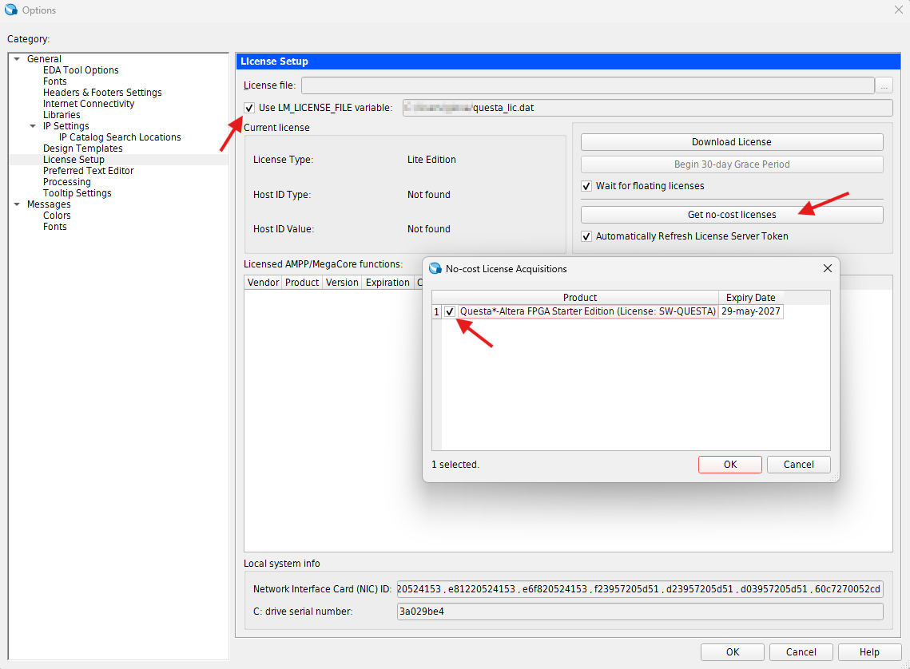

O programa deve baixar a licença no diretório base do seu usuário no seu SO. \
Para Windows, creio que o caminho padrão é `C:/Users/<seu_usuário>/questa_lic.dat`.

#### Definição das variáveis de ambiente

Por fim, deve-se garantir que as variáveis de ambiente da sua licença Altera estão definidas e apontam para ela.

Localize sua licença, copie o caminho do arquivo e defina-o como valor das seguintes variáveis. Por precaução, eu defino todas as seguintes variáveis:
- `LM_LICENSE_FILE`
- `SALT_LICENSE_SERVER`
- `SALT_LICENSE_FILE`

Exemplo no Windows: \
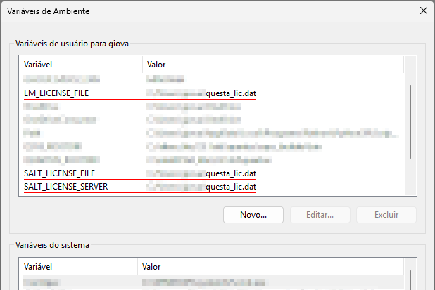

Exemplo de erro na simulação por variável não definida (`SALT_LICENSE_SERVER`): \

> [!note]
> Acredito que a variável `LM_LICENSE_FILE` é essencial para o Quartus Prime 24.1 e `SALT_LICENSE_SERVER` pro 25.1. Como teve um rebranding de Intel &rarr; Altera nesses tempos, devem ter mudado alguns detalhes de licença e do software. Parece que introduziram algumas inconsistências depois dessa mudança.

## Desenvolvimento em HDL - Verilog

[em desenvolvimento]

## Compilação do design - Quartus

Selecione o arquivo correto como Top-Level \
Na seção Project Navigator, selecione a aba Files. Clique com o botão direito sobre o arquivo e selecione a opção "Set as Top-Level Entity".

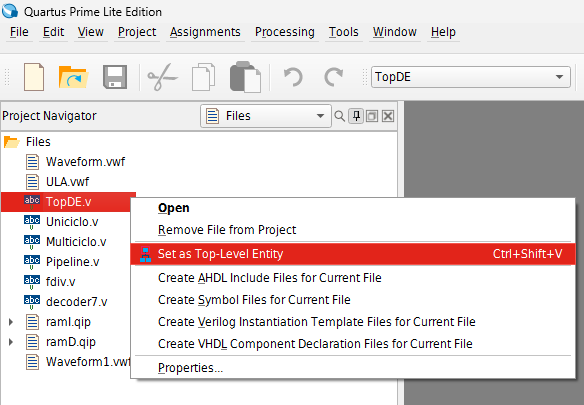

Caso esteja compilando o processador RISC-V 24.1, selecione a **organização e a ISA** a desejadas no arquivo `Parametros.v` e garanta que `TopDE.v` esteja como Top-Level.

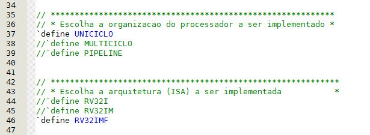

Após a compilação, analise os requisitos físicos e temporais como explicado a seguir.

### Análise dos requisitos físicos
Anote os valores mostrados no Flow Summary depois da compilação:
- Total de ALMs 
- Total de registradores
- Número de bits usados
- Número de blocos DPS

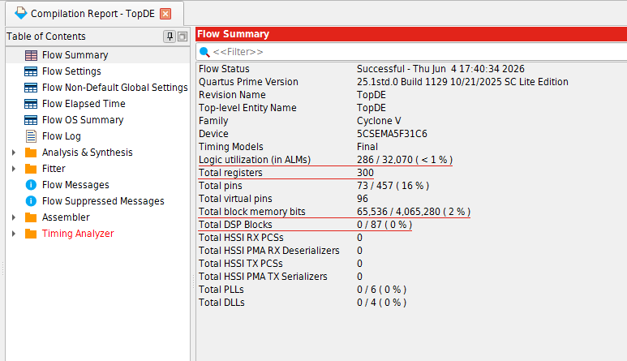

### Análise dos requisitos temporais

1. Tools > Timing Analyzer \
    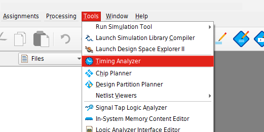

1. Na janela aberta, na seção "Tasks" à esquerda, clique duas vezes nas opções "Create Timing Netlist", depois em "Report FMax Summary" \
    Anote a **frequência máxima** para o design. Arredonde esse valor para baixo e use-o pra calcular o **perído mínimo de clock** que o design aguenta.

    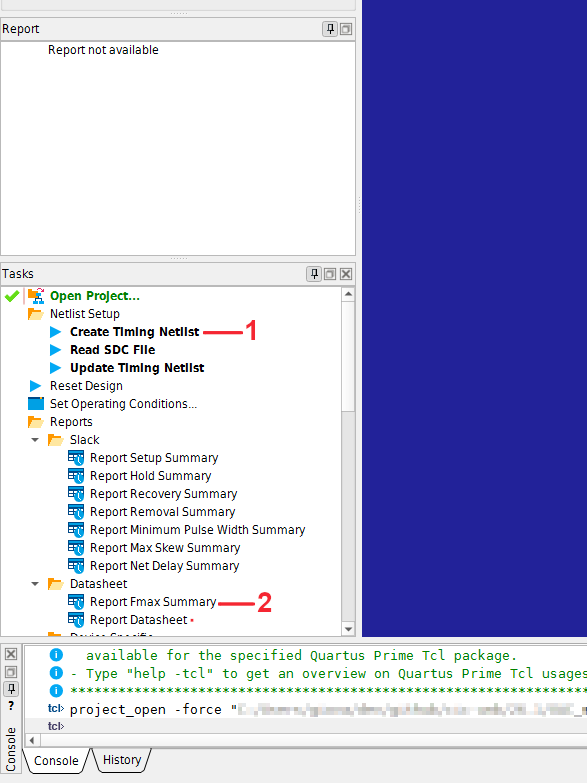

1. **Caso seu projeto seja síncrono** (utilize clock) crie um clock. Vá em Constraints > Create Clock
    1. Dê um nome significativo para o clock
    2. Defina o período como o período mínimo de clock calculado anteriormente
    3. Clique nos 3 pontinhos
    4. Na janela que abrir, clique no boão "List" para listar todos os pinos
    5. Encontre o pino de clock do seu módulo Top-Level
    6. Selecione-o apertando no botão ">"

    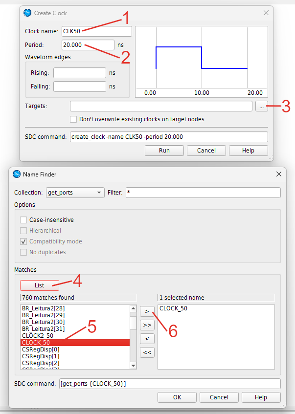
    
    Ao final do processo, a janela de criação de clock deve se parecer com o seguinte. Clique OK e o clock será criado. \
    Siga o resto dos passos abaixo.

    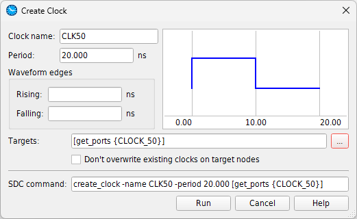

2. Clique duas vezes na opção "Report Datasheet"
    As instruções a seguir só valem se esta foi a tabela gerada por último. Caso tenha gerado outra tabela, basta clicar novamente em "Report Datasheet" para voltar para a tabela de interesse aqui.

    Na seção "Report" também à esquerda, visualize as tabelas e anote:
    - Setup Times (**tsu**): anote o **menor** valor entre Rise e Fall
    - Hold Times (**th**): anote o maior valor entre Rise e Fall
    - Clock to Output Times (**tco**): anote o maior valor entre Rise e Fall
    - Propagation delay (**tpd**): anote o maior valor entre RR, RF, FR, FF

    A tabela de **tsu deve ter valores negativos** em Report Datasheet, enquanto as tabelas de th, tco e tpd devem ter valores positivos. Se não seguir essa regra, quer dizer que o período de clock definido é curto demais e a execução terá hazards.

    Esse problema do clock também é verificável gerando os relatórios de Slack (Setup Summary, Hold Summary, etc.), no qual todos os valores apresentados devem ser positivos. Caso o valor seja negativo, aparecerá em vermelho, indicando que algum requisito temporal não foi satisfeito e o design pode estar sujeitos a falhas e comportamentos inesperados.

## Simulação - Quartus

[em desenvolvimento]

## Execução - FPGA DE1-SoC (Cyclone V)

### Carregar design na placa

Com um design compilado e um arquivo `.sof` correspondente na pasta `output_files`, é possível carregar o hardware simulado na placa FPGA.

1. Acesse Tools > Programmer

1. Selecione placa, clicando em "Hardware Setup" e, em "Currently selected hardware", escolha a DE-SoC \
    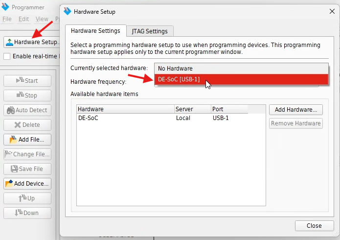

1. Voltando ao menu Programmer, clique em "Auto Detect" e selecione 5CSEMA5 \
    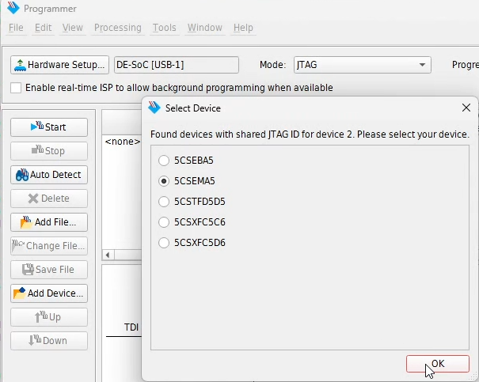

1. Clique "Yes" no aviso que surgir

1. Selecione o dispositivo 5CSEMA5, clique em "Change file..." \
    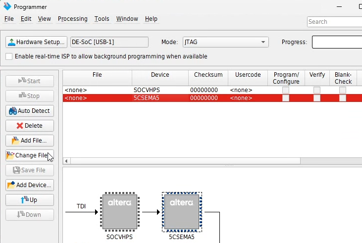

1. Selecione o design compilado `output_files/<seu_design>.sof` \
    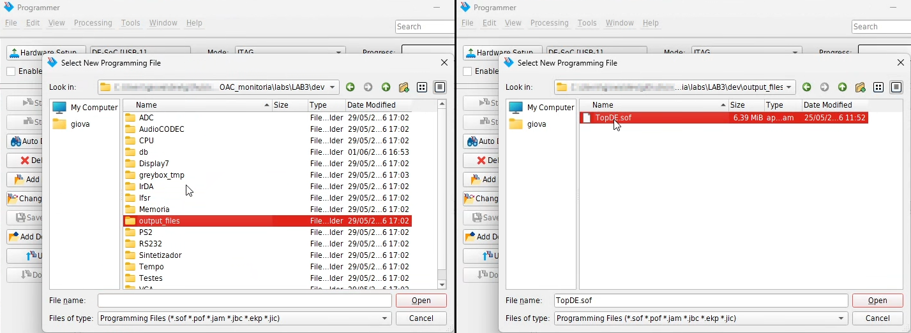

1. No despositivo com nome do seu arquivo `.sof`, presente na tabela, marque a opção "Program/Configure"

1. Aperte o botão Start e espere carregar na placa
    A placa vai acender um led verde até o design estar totalmente carregado.

Ao final do processo, a tela do Programmer deve estar assim e o seu design já está rodando na placa:

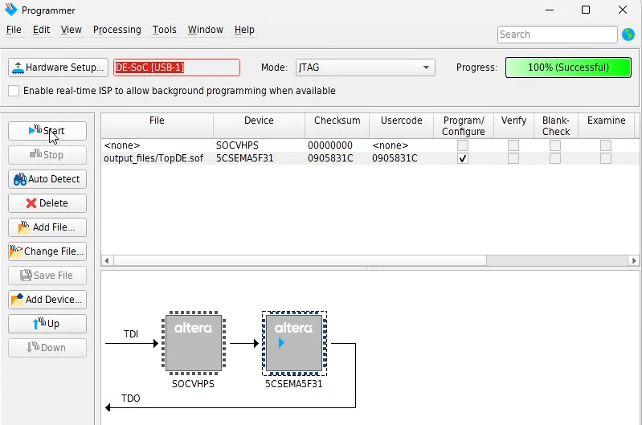

<!--
### Funções do processador RISC-V 24.1 (interface FPGA)

Caso esteja carregando o processador RISC-V 24.1 na placa, essas são algumas funções dele.

SW[5] \
    0 endereço \
    1 instrução

...

Frequência

caso SW[4:0] = 5'b00000
- freq = 50 MHz / 256

senão
- 50 MHz / (SW[4:0])
- varia de 50 MHz (5'b00001) até 50 / 31 = 1,61 MHz (5'b11111)

Display 7 segmentos
S[]

-->

### Gerar arquivos de inicialização de memória

Para instanciar memórias no projeto do Quartus, utilizamos arquivos `.mif` (Memory Initialization File) que guardam os dados sequencialmente, no formato `<endereço> : <dado>;`. No caso de processadores de 32b, precisamos que os dados sejam representados com 1 word cada.

Para gerar os arquivos `.mif` dos segmentos de dados e texto de um programa RISC-V, utilizamos a ferramenta RARS. \
Primeiro, abra o programa que deseja carregar no projeto no RARS e siga os passos:

1. Compile o programa. \
    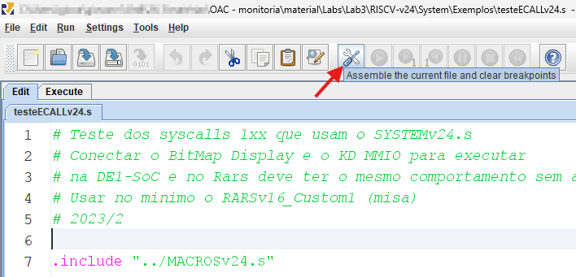

1. Selecione a ferramenta em File > Dump Memory \
    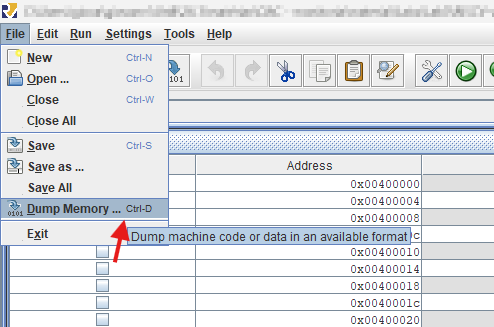

1. Clique no botão Dump to file \
    **Não precisa escolher `.text` ou `.data`** na opção Memory Segment, a ferramenta cria arquivos `.mif` para ambos os segmentos de uma só vez.

    Garanta que a o formato selecionado é **MIF format**.
    
    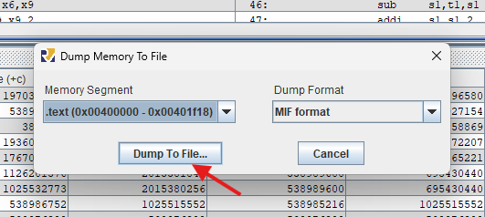

1. Escolha um nome significativo e uma pasta prática, de preferência específica para arquivos `.mif` e dentro do seu projeto.

### Criar unidades de memória no Quartus

1. Selecione o tipo de memória \
    No seu projeto no Quartus, vá para a seção "IP Catalog". Expanda as opções Library > Basic Functions > On Chip Memory. Selecione "RAM: 1-PORT"
    
    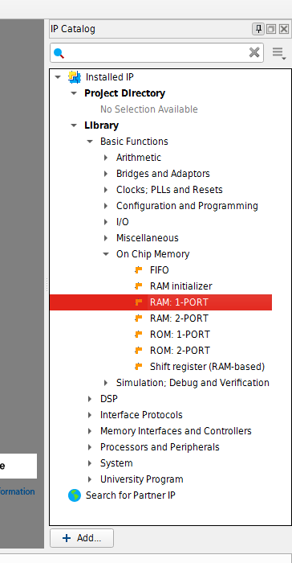

1. Dê o nome do módulo de memória \
    Nomes sugeridos: \
    `ramI` para memória de instruções \
    `ramD` para memória de dados

    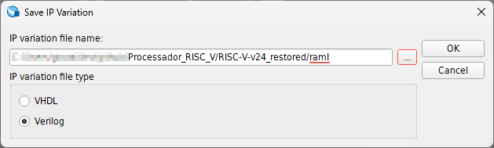

1.  Configure a unidade de RAM: 1-PORT \
    Somente as telas relevantes serão apresentadas com os passos necessários. As demais, basta avançar clicando "Next".

    1. Defina o tamanho da saída 'q' para 32 bits e o tamanho da memória para 1024 words \
        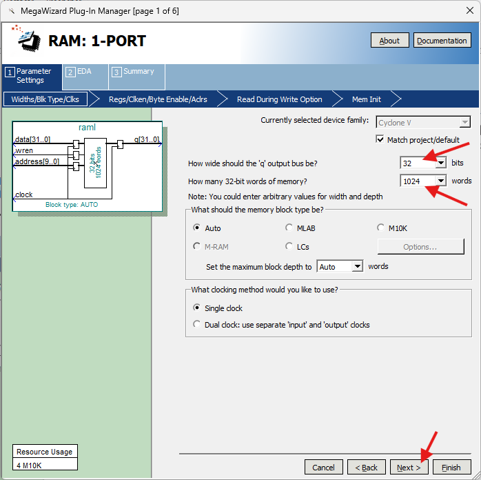
    
    1. **Desmarque** a opção "'q' output port" \
        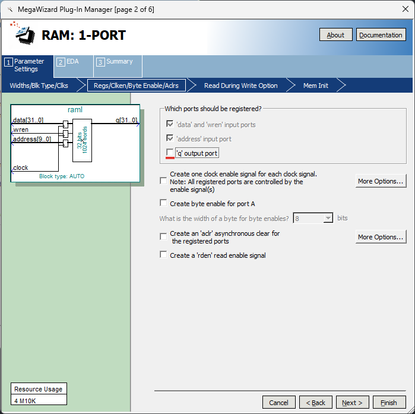

    1. Defina a leitura de endereço em escrita como "Don't Care" \
        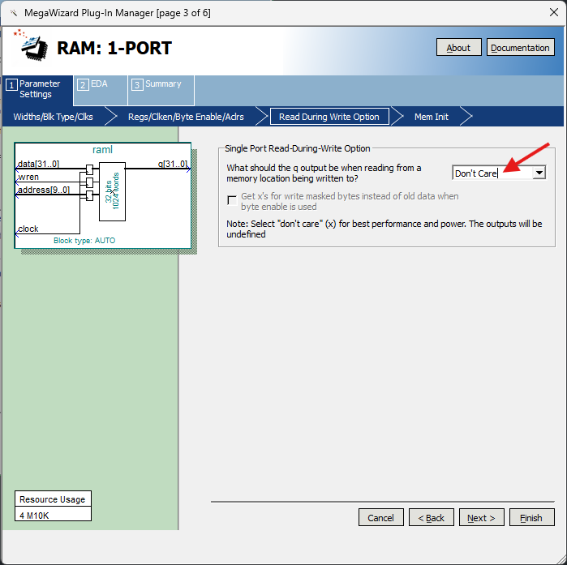

    1. Na tela de inicialização
        1. Selecione a opção "Yes"
        1. Selecione o arquivo com o conteúdo da memória em "Browse..."
        1. Nomeie a unidade de memória

        Nesse exemplo, estamos instanciando uma memória de instruções, então selecionamos um arquivo `*_text.mif` e damos o nome de "TEXT" para a unidade. \
        Para uma memória de dados, selecionaríamos um arquivo `*_data.mif` e poderíamos dar o nome "DATA".

        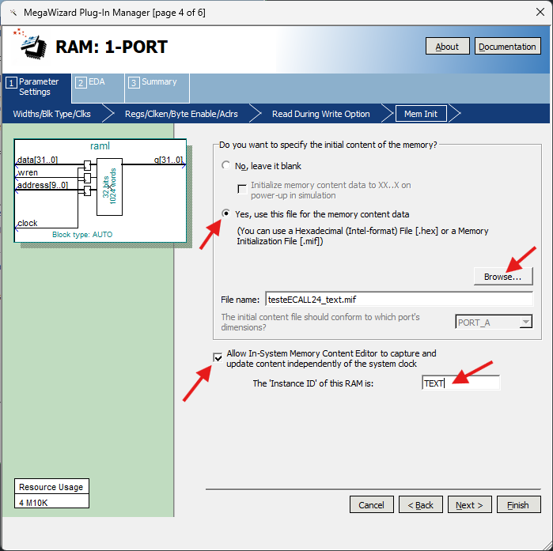
    
    2. **Desmarque** a opção de criar arquivos black-blox (`*_bb.v`) \
        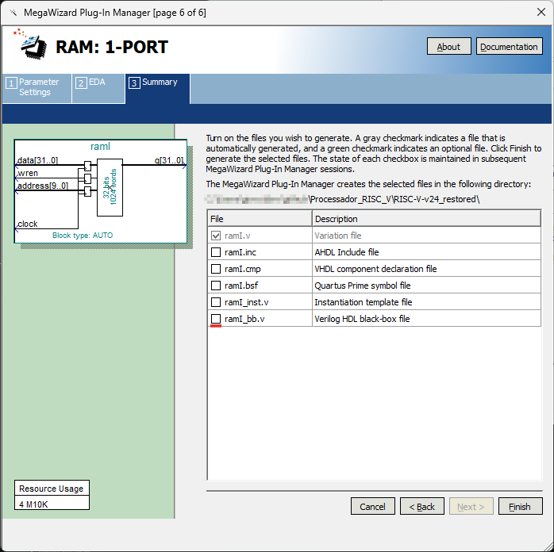

    3. Clique em "Finish" e confirme o aviso de adição do arquivo ao projeto.\
        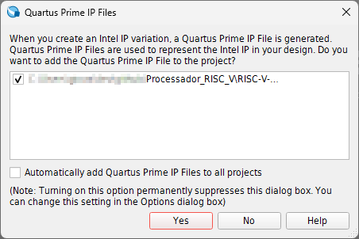

### Editar memória da placa

1. Tools > In-System Content Editor

1. `F5` mostra a memória carregada na placa \
    Caso não apareçam as unidades de memória de dados e programa, feche a janela e abra novamente (chance do Quartus travar).

    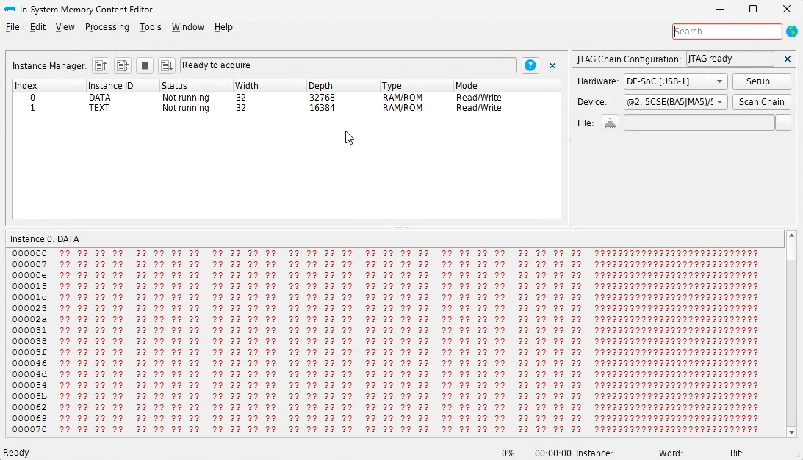

1. Selecione a unidade de memória (DATA, TEXT), clique com o botão direito e Import Data From File \
    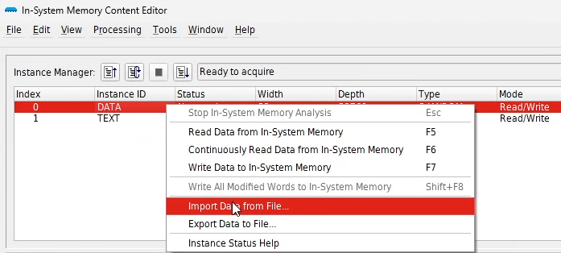

1. Selecione o arquivo `.mif` correspondente à unidade a ser reescrita (dados ou programa) \
    Lembre-se de selecionar o tipo correto de arquivo na opção "Files of Type", por padrão o explorador procura por arquivos `.hex` \
    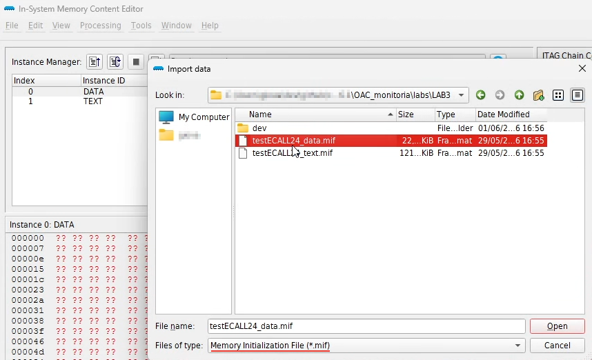

1. `F7` carrega a memória selecionada e sobrescreve na placa.\
    Obs.: Isso **NÃO** reinicia a execução na máquina, `PC` e o banco de registradores não mudarão. Aperte KEY[0] para reiniciar a execução.

# Referências

**M. V. LAMAR**. *Tutorial de uso do Quartus-Prime v2.2*.

Timing Analyzer: Introduction to Timing Analysis \
https://youtu.be/HMAqjjCuDEI
