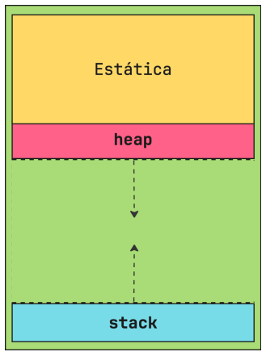
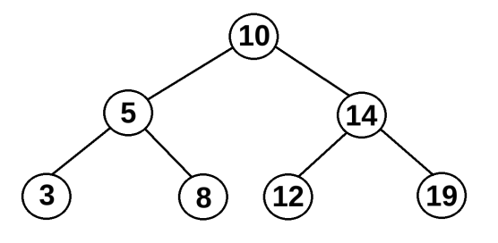
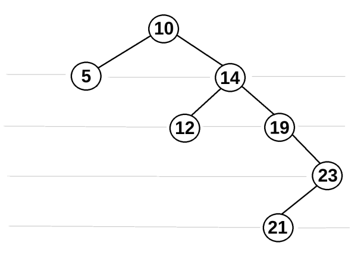

### compilação e bibliotecas
```c++
#include<bits/stdc++.h>
using namespace std;
```

```sh
g++ fonte.cpp -std=c++11 -o binr
```


### execução

./binr
./binr < input.txt    // inserção da entrada por arquivo txt
./binr > output.txt   // gravação da saída em arquivo txt


### tipos de dados
tipo            | mem (bits)  | intervalo               | IO em C
---             | ---         | ---                     | ---
char            | 8           | [-128, 127]             | %c
usigned char    | 8           | [0, 255]                | 
short           | 16          | [-32768, 32767]         | 
usigned short   | 16          | [0, 65535]              | 
int             | 32          | ~[-2 * 10^9, 2*10^9]    | 
unsigned int    | 16?? 32     | [0, 65535]              | 
long long       | 64          | []                      | 
unsigned long   | 64          | []                      | 
float           | 64          | []                      | 
double          | 64          | []                      | 

```c++
long l;
long int li;
long long ll;
long long int lli;
```

`long`, `long int` | surgiu na época da transição pra arquitetura de 32 bits, variava a depender do sistema

`long long`, `long long int` | garantem o uso de 64 independente do compilador e arquitetura

boa prática de competição: sempre use long long no lugar de int para evitar overflow aritmético

> obs. a omissão do int é apenas por concisão, o tipo ainda é o mesmo

### I/O
cin cout são mais lentos que scanf e printf por terem um fluxo de dados próprio. ele precisa sincronizar os buffer de I/O entre terminal e programa. isso garante que um output não é lido como input ou vice versa

em competições, é perfeitamente razoável desabilitar a sincronização pra garantir leitura e escrita rápidas

#define fastio ios::sync_with_stdio(false)  // desabilita a sincronização de buffer

### estruturas de repetição

#### iteração de estruturas enumeráveis

```c++
for (type varName : arrName) {}

int myNumbers[5] = {10, 20, 30, 40, 50};
for (int n : myNumbers) {
    cout << n << endl;
}
```

#### iteração condicional
```c++
do {
    // primeira execução
}
while (cond) {
    // seguintes execuções caso condição seja satisfeita
}
```

### passos e dicas para resolução
1. entender o problema
2. entender pq exemplos estão certos
3. checar restrições e casos-limite
4. esboçar uma solução que passe nos exemplos
5. escrever solução completa

checar domínio de valores de entrada (intervalo, avaliar solução para mínimo e máximo)

### Strings


### Pairs
```cpp
pair<int, int> par1;
par2 = make_pair(const tipo1, const tipo2);

// acesso first e second
coord = make_pair(-2, 4);
printf(coord.first, coord.second);

// comparação de pares - checagem ~lexicográfica
pii1 = make_pair(1, 2);     // pii | pair int int
pii2 = make_pair(2, 3);     // v2 > v1 pq v2.first > v1.first
pii3 = make_pair(2, 2);     // v2 > v3 pq v2.second > v3.second
```

### Vector
alocação dinâmica, inicializa e atualiza com mais posições alocadas do que "preenchidas", pra otimizar o redimensionamento do vetor

### Iteradores

```cpp
int main()
{
  vector<int> ar = { 1, 2, 3, 4, 5 };
  vector<int>::iterator ptr;          // ptr é do tipo iterator de vector<int>

  printf(”The vector elements are : ”);
  for(ptr = ar.begin(); ptr < ar.end(); ptr++)  // .end() aponta pra primeira
    printf(”%d ”,*ptr);     // posição vaga, 1 posição à frente do último elemento
  printf(”\n”);
  return 0;
}

// v = [1,    2,    3,    4,    5,    ???]
//      v.begin()                     v.end()

```

```cpp
for (auto it = v.begin(); it != v.end(); ++it) {
  cout << *it << endl;
}
// ou 
for (int x : v) {       // range-based for, por baixo usa iterators
  cout << x << endl;
}
```

#### lower_bound, upper_bound
funções de iteração de intervalos **ordenados**. recebem ponteiros que delimitam um intervalo ordenado e um valor para comparar a magnitude

```cpp
vector<int> v = {1, 3, 3, 5, 7};
auto it1 = lower_bound(v.begin(), v.end(), 3);
cout << *it1 << endl; // imprime 3, e it1 é iterador na posição 1 do vetor

auto it2 = upper_bound(v.begin(), v.end(), 3);
cout << *it2 << endl; // imprime 5, it2 é um iterador na posição 3 do vetor

int count = upper_bound(v.begin(), v.end(), x) - lower_bound(v.begin(), v.end(), x)
// conta quantos elementos de valor x existem no vetor ordenado v
// aritmética de ponteiros, dado que upper_bound e lower_bound retornam iteradores de vector<int>, têm mesmo tipo
```

> exercício - EDUCATIONAL CODEFORCES ROUND 74 A
> Prime Subtraction
> todos 2 inteiros positivos 


> aula 01/04/26

> obs. em geral, soluções recursivas são mais custosas temporalmente pelo tempo de alocar/desalocar memória na stack a cada chamada

## Memória



Alocação estática: SO aloca variáveis e funções? globais,
Alocação automática
Alocação dinâmica


### Ponteiros
- acesso a elementos de um array ou outra ED
- alocar memória dinamicamente
- passar argumentos como referência (poupando stack) [em especial, passando EDs como argumentos]
- retornar vários valores

`*` (precedido de tipo): tipagem de ponteiro referente a tal tipo \
`*` (operando sobre variável): operador de endereço \
`&` : operador de desreferência

> boa prática: sempre bom atribuir null (0) a um ponteiro sem endereço exato a ser atribuído

`malloc(size)` : aloca memória do tamanho pedido e retorna ponteiro para o início dela
`calloc(size)` : aloca memória do tamanho pedido, zera ela e retorna o ponteiro pro início
`realloc(size)`
`free(ptr)`

-> caso de falha de alocação

### Vazamento de memória
fácil de causar, difícil de notar e diagnosticar

algumas causas mais sorrateiras
- saídas de função/interrupção sem desalocar ponteiro
- sobrescrever um ponteiro, perdendo a referência original e impossibilitando a desalocação (se tentar liberar, vai liberar apenas a nova memória referenciada)

### Controle


### Erros Comuns e Dicas
erros que custam pontos
- WA - Wrong Answer
- RTE - Runtime Error
- CTE - Compilation Time Error (inaceitável ser na submissão)
- TLE - Time Limit Exceeded

#### overflow
sempre considerar intervalos dos dados

#### leitura/escrita
```cpp
ios::sync_with_stdio(false);  // Desativa sincronização com C
cin.tie(0);                   // Desacopla cin de cout
cout.tie(0);                  // Desacopla cout de cin

int n; cin >> n;

for (int i = 0; i < n; i++) {
  int x; cin >> x;
  cout << x << ’\n’; // ’\n’ é mais rápido que endl
}
```

#### indexação fora dos limites
```cpp
vector<int> v(5); // Índices 0 a 4

for (int i = 0; i <= 5; i++) {
  v[i] = i; // Erro: v[5] não existe
}
```


## Algoritmos de busca

### Busca binária

- Busca sequencial
  - complexidade de tempo O(n)
  - independente do array, sempre tem o resultado esperado (completo)

- Busca binária
  - complexidade de tempo O(log n) (log2 n mais especificamente)
  - **precisa** que o vetor esteja ordenado para encontrar o valor esperado
  - isso pq divide o vetor ao meio e compara o valor buscado com o pivô (bem ao meio) para então iterativamente dividir a lista e fazer essa comparação

```cpp

int buscaBinaria (int array[], int m, int query) {
  int i =
}
```

exemplo: tentar adivinhar sqrt(n) sem utilizar a função (método da bissecção)
sabemos que 1 <= sqrt(n) <= n
num vetor [1.0, 1.5, 2.0, 2.5, 3.0, 3.5, 4.0], vamos utilizar busca binária para aproximar a raíz de 4.0
pivô: 2.5; 2.5 * 2.5 > 4? sim
pivô: 1.75; 1.75 * 1.75 > 4? não
pivô: 2.125; 2.125 * 2.125 > 4? sim

pra impedir uma repetição infinita da operação, caso o ponto médio nunca seja exatamente o valor buscado, precisamos definir uma margem de erro aceitável para a aproximação, com r - l <= ε; [l, r] é o intervalo onde o valor buscado deve estar

cf round #750 A
beecrowd 1912
cses 1085 array division

#### Monotonicidade

### bounds

lower_bound: retorna o primeiro valor >= x do vetor
upper_bound: retorna o primeiro valor > x

## Estruturas de dados

para escolher uma ED mais apropriada para um problema, devemos analisar qual comportamento ela precisa ter (inserções, busca, remoções, atualizações) e se as operações que ela permite são compatíveis com as complexidades de tempo e memória necessárias

a inserção é
- no início
- no meio
- no final

o critério de armazenamento é
- ordenado
- não-ordenado

### EDs lineares
dados formam uma sequência linear, seguem uma ordem
- alocação estática: arrays nativos (sabemos a dimensão do array)
- alocação dinâmica: lista dencadeada, pilha, fila, fila de prioridade (tamanho desconhecido)

#### lista encadeada
- flexível, não exige reordenar grandes blocos de memória para atualizá-la
- busca, inserção e remoção de elementos ineficiênte, em geral. O(n)

#### fila
elementos são inseridos no final e removidos no início
- first-in first-out (FIFO)
- rígida mas útil para manipular dados preservando sua ordem de inserção
- busca O(n)
- inserção e remoção O(1)
- extremidades front e back?

```cpp
queue<int> fila;

fila.push(2);                                   // fila 2
fila.push(3);                                   // fila 2 3

int frente = fila.front();
printf(”Frente da fila: %d\n”,frente);          // saída 2, fila 2 3
fila.pop();
printf(”Frente da fila: %d\n”, fila.front());   // saída 3, fila 3

printf("Fila vazia? %b", fila.empty());         // checa se está vazia
```

#### pilha
elementos são inseridos no topo e removidos do topo
- last-in first-out (LIFO)
- rígida, mas útil para tratar os últimos dados primeiro
- busca O(log n)
- inserção e remoção O(1)
- extremidades base e topo

```cpp
stack<int> pilha;

pilha.push(4);
pilha.push(6);

int topo = pilha.top();
printf(”Topo da pilha: %d\n”, topo);    // saída 6, pilha 4 6

pilha.empty();                          // false

pilha.pop();                            // pilha 4 6
```

#### fila de prioridade
fila ordenada conforme um critério de ordenação \
semelhante a uma heap (análogo a uma árvore balanceada). no caso do C++, é uma heap implementada com vector. por padrão, é uma fila de prioridade máxima

- mais flexível, bastante útil e prática para algoritmos complexos
- busca do máximo O(1); busca genérica O(log n)
- inserção e remoção O(log n)
- a raiz é o topo

```cpp
priority_queue<long long> pq_max;                       // fila de prioridade máxima

priority_queue<int, vector<int>, greater<int>> pq_min;  // fila de prioridade mínima

pq_max.push(3);   // fila prior. 3
pq_max.push(5);   // fila prior. 5 3
pq_max.pop();     // fila prior. 3

pq_max.empty();   // false

// customização da fila de prioridade

priority_queue<pii,vector<pii>,cmp> pq_pii;

// sendo
class cmp {
  public:
    bool operator()(pii a, pii b) {
      if (b.second < a.second)
        return true;
      return false;
    }
}
```


### EDs não-lineares

quando há uma relação de hierarquia entre os dados

#### Árvore Binária de Busca - ABB (Binary Search Tree = BST)

árvore em que cada nó tem no máximo dois filhos \
há um nó raiz, no topo da árvore, e folhas, nas pontas

todo nó tem uma chave (valor). seu filho da esquerda, se houver, deve ter chave menor que a sua, e seu filho da direita deve ter chave maior



para ter ganho de desempenho, precisamos que a BST seja balanceada; no pior caso, em que inserimos chaves sempre maiores ou sempre menores, a árvore ficará extremamente desbalanceada e tecnicamente linear, piorando seu desempenho e causando complexidade O(n) \
para evitar isso, devemos escolher uma chave adequada, idealmente a mediana dos valores das chaves ordenados



### Set (conjunto)

implementado por uma BST balanceada


### Map


### Hash

devemos escolher bem a função hash para o contexto do uso da tabela hash. podemos configurar o tamanho da tabela, oferecendo mais posições e diminuindo colisões, e podemos escolher a 

#### Hashset

#### Hashmap


### Grafo

grafo G = (V, E), em que V é um conjunto de vértices e E é um conjunto de arestas que ligam esses vértices

em um grafo simples, suas arestas apenas liga dois vértices, enquanto em um grafo ponderado, suas arestas associam um peso à essa ligação

um grafo pode ser direcionado de forma que uma aresta que liga os vértices u e v é apenas saída para u e apenas entrada/chegada para v

uma aresta pode ser um laço/loop, ligando um vértice u a ele mesmo

podemos ter arestas paralelas, ou seja, que ligam os mesmos vértices (têm os mesmos vértices terminais)

o grau de um vértice é a incidência de arestas nele, ou seja, se está ligado a 

passeio: sequência de arestas partindo de u e chegando a v
caminho: passeio sem repetição de vértices

ciclo: sequência de arestas partindo de u e chegando a u

grafo conexo: para quais quer dois vértices de um caminho, há um caminho entre eles (há um vértice desconexo). obs: essa condição é mais comum em grafos direcionados

componentes conexos: grupos de vértices (subgrafo) conexo

grafo bipartido: grafo em que podemos separar os vértices em dois subconjuntos, sendo que dois vértices de um subconjunto não compartilham uma aresta

árvore: caso particular de grafo em que E = |V - 1|

#### Representações de grafo

##### Matriz de adjacência

matriz VxV:
- num grafo simples, o elemento aij (1 ou 0) indica se há ou não aresta ligando o vértice i ao j, com 0 <= i, j <= V-1
- num grafo ponderado, o elemento aij indica se há ou não aresta ligando o vértice i ao j, sendo aij seu peso ou 0, caso não exista aresta

em grafos bidirecionados/não direcionados, a matriz é simétrica em relação à diagonal principal

##### Lista de adjacência

vetor de vetores

#### Busca

percorremos um grafo de acordo com uma ordem, sempre monitorando se um vértice já foi visitado ou não

##### Busa em Profundidade (Depth First Search - DFS)

escolhemos um nó e visitamos primeiro os vizinhos dos vizinhos. sempre que visitarmos 

bom para identificar se há caminho entre vértices

##### Busca em Largura (Breadth First Search - BFS)

escolhemos um nó e visitamos todos seus vizinhos para então visitar os vizinhos destes

encontra o caminho mais curto entre o vértice inicial e outro qualquer


#### Caminhos em grafos

caminho: sequência não nula de arestas sem repetição de vértices, a primeira partindo de u e a última chegando a v

caminho mínimo: caminho de menor custo, ou seja, considerando um grafo ponderado, caminho de u a v com menor soma de pesos possível

##### Algoritmo de Dijkstra

queremos encontrar o caminho mínimo de u e s. fazemos entrão uma busca em largura, mas priorizando a visita a vértices com menor custo de chegada

precisamos armazenar
- um vetor com os custos de chegada para cada vértice partindo de u
- 

- o processamento de cada aresta tem complexidade O(|E|) e a inserção na fila de prioridade é O(log n), então Dijkstra tem complexidade O(|E| * log n), sendo n < |E|
- 

>!NOTE
> Essa implementação não comporta grafos com pesos negativos, pois poderia 

###### Relaxamento

se sabemos que há um caminho entre t e v com custo 6 mas encontramos um outro caminho de u a v com custo 4, o custo até v é o custo até t + 4, substituindo o custo até t + 6

se o custo até um vértice t é 4 e, por enquanto, o custo até outro v é 7 e descubro uma aresta t -> v com peso 2, então esse caminho custa menos que o descoberto anteriormente, então atualizamos o custo até 
(ideia de relaxamento de uma mola)

##### Algoritmo Floyd-Warshall

determina o caminho mínimo entre todos os pares de vértices conectados em um grafo ponderado

verifica se é possível encontrar um vértice intermediário que minimize uma distância já computada. para cada vértice, checa se ele pode ser um vértice intermediário que diminui algum custo de caminho entre quaisquer dois outros vértices

precisamos armazenar
- de uma matriz das distâncias entre cada par ordenado de vértices

- complexidade O(|V|^3)
- porém, em


##### outros algoritmos
- Bellman-Ford
- algoritmo de árvores geradoras mínimas
- Kruskal
- Prim


## Soma de prefixos

temos um vetor de inteiros e queremos fazer q consultas nele, de forma que cada consulta opera sobre um intervalo [l, r] de posições desse vetor e deve retornar a soma de todos os inteiros presentes no intervalo

se a cada consulta acessamos 

## Programação delta

vetor delta \
posição do início do intervalo += 1 \
posição logo após o fim do intervalo -= 1 (caso não seja fora do vetor)

vetor psum \
pos_delta = delta[0] \
pos_delta += delta[i] \
psum[i] = v[i] + pos_delta


# Paradigmas para programação competitiva

- Busca completa
- Divisão e conquista
- Algoritmos gulosos
- Programação dinâmica

## Busca completa

exaurir todas os casos possíveis para encontrar uma solução \
desvantagens: custoso, implica em complexidades maiores de tempo e memória \
vantagens: simplicidade da implementação, certeza da resposta certa

### Geradores e filtros


### Produto cartesiano

dados n conjuntos de dados, formamos todas as tuplas de tamanho n possíveis, d

a geração dos subconjuntos está vinculada à forma que definimos os conjuntos de dados (vector, máscara de bits, set)

### Permutações

`next_permutation()`, `prev_permutation()` | utilizam iterators

### Combinações

$$

com repetições:

$$

## Divisão e conquista

vantagens: \
desvantagens: 

**Merge Sort**: eu sei ordenar dois inteiros. se tenho um vetor, posso dividi-lo em sub vetores até que cada um contenha apenas um inteiro. assim, vou ordenando cada um e formando novamente sub vetores, agora ordenados. faço isso, comparando pares de inteiros, até que tenha formado o vetor final com todos os elementos ordenados


## Algoritmos gulosos

deixa a força bruta de lado. avalia a situação atual e prevê qual é o melhor passo a se tomar para cortar casos desnecessários/não promissores

vantagens: otimiza complexidades de tempo e memória \
desvantagens: não garante uma resposta certa nem ideal (não completo nem ótimo); lógica complexa

escolhemos uma heurística (implementada ou conceitual) para prever a melhor solução local, de forma que todas as soluções locais contribuam para a melhor solução global

### Técnica de Two Pointers

dado uma estrutura linear, podemos ter um ponteiro em cada extremidade, `l` e `r`

#### 2Sum

temos um vetor **ordenado**

definimos os ponteiros
- se a `*l + *r > alvo`, decrescemos `r` em 1
- se a `*l + *r < alvo`, incrementamos `l` em 1
- se a `*l + *r = alvo`, temos a resposta
- se `l == r`, não há resposta

cada posição é checada apenas uma vez

#### 3Sum

temos 3 ponteiros, `l`, `r` e `k`

## Programação dinâmica

busca a resposta correta, mas reutilizando resultados de computações para evitar computar dados desnecessários ou redundantes

vantagens:
desvantagens:
