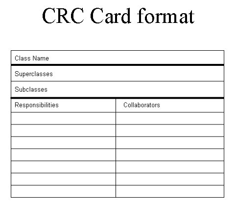
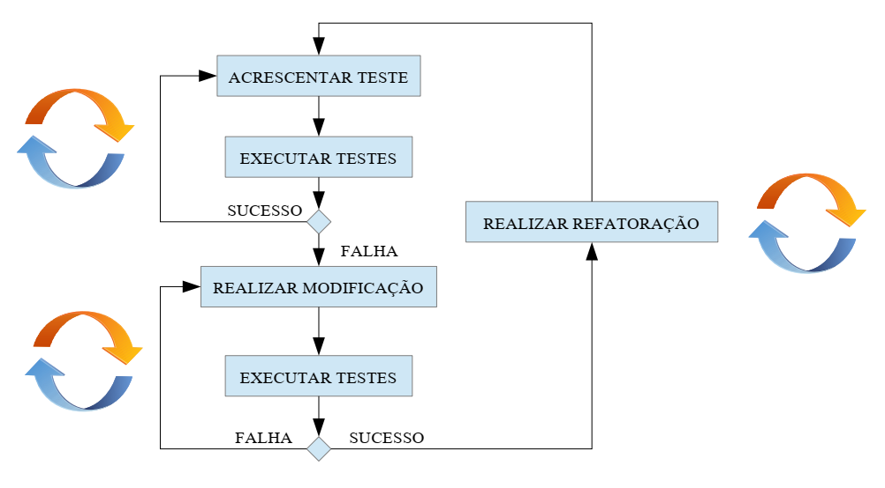

CIC0105 Engenharia de Software

## Processo Unificado de Desenvolvimento Software (USDP ou UP)

framework configurável de processo de desenvolvimento iterativo e incremental, guiado por casos de uso, centrado na arquitetura. enfatiza planejamento de processo

Regulamento de referência:  (UP simplificado)

desenvolvimento de software é representado por ciclos, em que cada ciclo se produz uma versão do sistema

cada ciclo é dividido em fases:

### Concepção

visão inicial, identificar stakeholders e objetivos, identificar principais riscos

Entradas: \
Saídas:

### Elaboração

detalhar casos de uso, projetar e modelar arquitetura, especificar recursos e custos

Entradas: \
Saídas:

### Construção

modificação da arquitetura, sucetível a defeitos, possível protótipo, consumo dos recursos

Entradas: \
Saídas:

### Transição

teste de versão beta, identificação e correção de erros, pode incluir distribuição de versão pública e treinamento (transição de equipes)

Entradas: \
Saídas:

### Iteração

Cada fase, por sua vez, é divida em iterações com:
- enfoque em determinados casos de uso \
    relevantes e prioritários dado ciclo e fase de desenvolvimento
- trabalha sobre artefatos de iterações anteriores
- engloba atividades de análise, projeto, implementação e teste

Cada iteração tem uma rotina inicial de planejamento da iteração e final de avaliação do trabalho produzido \
Cada iteração produz um incremento no sistema

### Vantagens (do modelo iterativo)

- facilitação da avaliação de risco
- perdas contidas em iteração, menores danos
- flexibilidade e boa aderência a prazos
- ajuda a detectar problemas em tempo devido (dificultando antecipação desnecessária e omissão)
- permite melhor enfoque em cada iteração, visão menos abrangente
- adaptável à mudança de requisitos

## Processo de software aberto

### Processo de teste

para cada nova iteração implantada, é definida uma janela de teste (geralmente curta) pra comunidade realizar teste de fumaça: se nada quebrar, é aprovada a iteração e ela entra pra versão distribuída

#### Marca D'água

## Métodos/arcabouços ágeis

### XP

técnicas de planejamento
- iterações curtas, poucas semanas (sempre atualizando o planejamento)

- priorização de histórias de usuário (custo, impacto)

- contribuição entre cliente e desenvolvedores nas estimativas, priorização, 

 

técnicas de projeto e desenvolvimento

- Class, Responsibilities, and Collaboration (CRC) \
  modelagem de classes simples, pra projetar o sistema em reuniões, coletivamente. cada classe tem nome, (opcionalmente, super e sub-classes) suas responsabilidades e quais são suas colaboradoras

  

- simplicidade no projeto \
  sem antecipações desnecessárias de funcionalidades (alto custo: atrasos, imprecisões levando a correções)

- Test Driven Development (TDD)
  - testes de unidade (confiança para os desenvolvedores)
  - testes funcionais (confiança para cliente/stakeholders, demonstra incremento de valor do produto)

- programação em pares

- propriedade coletiva de código (decisão mais descentralizada, desenvolvedor como stakeholder)

- refatoração frequente, buscando
  - melhorar comunicação (concisão, clareza)
  - remover código duplicado, funcionalidades não usadas
  - facilitar manutenção

- integração contínua e entrega frequente a clientes

### Scrum

time boxing: delimitar durações a serem respeitados (duração de sprint, eventos de reunião, etc.)

#### Eventos

<!--
seções
- gerenciamento
- desenvolvimento
- avaliação e QA
- testagem
- 
-->
