CIC0202 - Programação Concorrente

programas sequenciais são previsíveis. é sempre possível esperar um mesmo resultado a cada execução

programas concorrentes podem bem mais difíceis de prever a cada execução:
- threads podem ser criadas em qualquer ordem
- o escalonamento do SO é imprevisível, pois há outros programas sendo executados e preocupações em consideração
- a depender do compilador e processador, um programa pode ter diferentes tempos de execução e instruções (consequentemente, diferentes contagens de instrução)

assim, erros e execuções particulares podem ser bem difíceis de reproduzir

# Processos


Analogia de preparação de bolos

| factual           | analogia           |
| ----------------- | ------------------ |
| programa          | receita            |
| dados de entrada  | ingredientes       |
| processador       | cozinheiro         |
| processo          | preparação um bolo |
| pilha de execução | linha de produção  |

considerando um SO de core único que administra múltiplos processos concorrentes:
- o processador executa, de fato, um processo por vez
- cada processo tem uma seção da memória reservada, contendo uma pilha de execução com seus contextos de procedimentos (variáveis e argumentos, endereços de retorno )

CPU e threads virtuais: um mesmo processador pode executar apenas uma instrução (atender apenas um processo) por vez, mas ele pode chavear entre processos, alternando entre threads virtuais (pseudoparalelismo, multiprogramação)

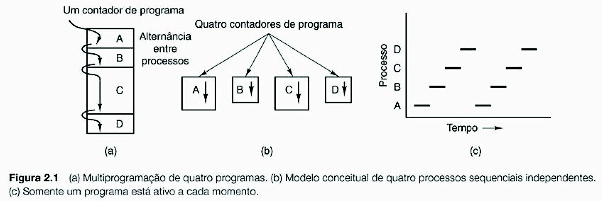

obs: mesmo que seja uma organização pipeline, cada estágio do pipeline é dedicado a apenas 1 instrução

**espera ocupada**: uma thread travada por uma asserção, só avança caso ela seja satisfeita, **gastando recursos** de acesso à memória e avaliação de expressões enquanto **espera**

recursos de um processo
- memória: seção armazenando instruções e dados
- CPU: janela de disposição da CPU para o processo
- dispositivos: comunicação de I/O com periféricos ou memórias externas
- arquivos

um processo é formado por 3 elementos básicos:

- contexto de hardware

  conteúdo de registradores (PC, SP, ...), alternados na **troca de contexto** entre processos

  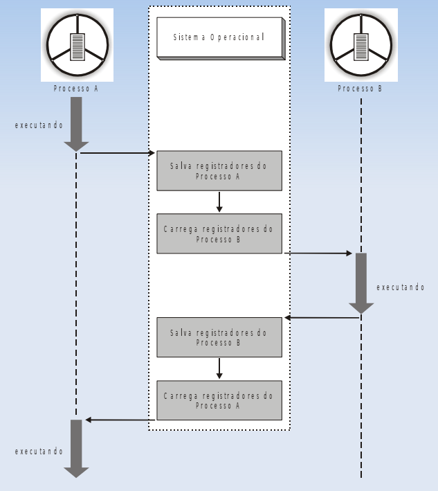

- contexto de software
  - identificação \
    **PID** (Process Identification)

    **UID** (User Identification)

  - quota \
    limites de reserva de recursos

  - privilégios \
    relativos a SO e a outros processos

- espaço de endereçamento \
  espaço de memória onde o programa é armazenado e o o espaço para seus dados

  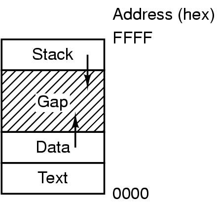


<br>

criação de processo
- eventos de inicalização
  - inicialização de sistema

  - chamada de sistema (de um processo) para criação de um processo filho \
    ex: chamada `fork` em UNIX, copiando o contexto de execução do pai para o filho

  - requisição do usuário para criação de processo

  - início de tarefa em lote \
    em computadores de grande porte

saídas de processo
- voluntária
  - normal, sem erro
  - exceção, com erro
- involuntária
  - erro fatal
  - cancelamento por outro processo \
    ex: chamada `kill` no UNIX

tipos de processo (de acordo com seu processamento):
- CPU-bound \
  passa maior parte do tempo utilizando o processador
- I/O-bound \
  passa maior parte do tempo realizando operações de I/O

  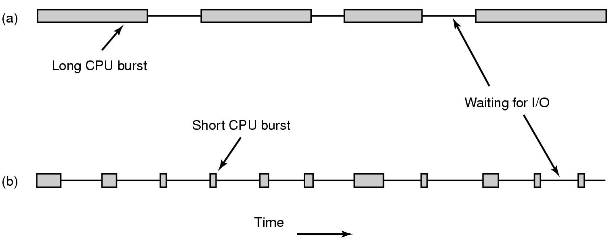

tipos de processo quanto comunicação
- independente
  não pode afetar ou ser afetado pelos processos em execução
- cooperativos \
  pode afetar ou ser afetado por outros, compartilhando arquivos, variáveis, etc.

  precisam de Interprocess Communication (IPC) que permita troca de dados
  - memória compartilhada: é delimitada uma área de acesso comum aos processos em comunicação
  - memória distribuída: a comunicação é feita por mensagens

estado de processo (atividade atual), segundo Tanenbaum, podem ser:
- em execução: sendo atentido pela CPU
- pronto: aguardando execução
- bloqueado (em lock): ocioso, esperando ocorrência de evento externo (não compete pela CPU)

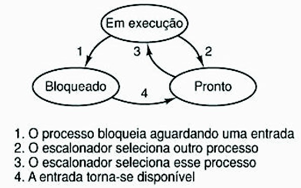


## Implementação e gerenciamento

o gerenciamento de processos é implementado por uma **tabela de processos**, com campos para:
- gerência de processos
- gerência de memória
- gerência de arquivos

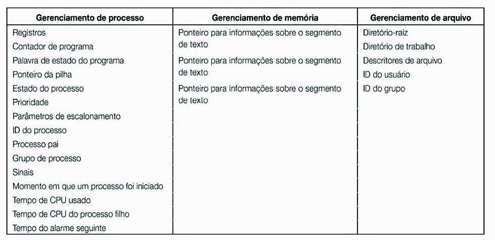


```c
fork();
```

Exemplo de uso de `fork` (um processo criando outros processos)
```
# execução x
proc 0
pid 478090
pai 477976          (terminal executando o programa)
valor 8

    proc 1
    pid 478093
    pai 478090
    valor 10

    proc 2
    pid 478091
    pai 478090
    valor 10

        proc 3
        pid 478092
        pai 478091
        valor 12

# execução y
proc 0
pid 478212
pai 477976          (terminal executando o programa)
valor 8


    proc 1
    pid 478214
    pai 478212
    valor 10

    proc 2
    pid 478213
    pai 2420        (proc 0 terminou antes de proc 2 executar, deixando-o órfão)
    valor 10

        proc 3
        pid 478215
        pai 478213
        valor 12
```

## Multiprogramação

otimiza o compartilhamento da CPU entre processos que costumeiramente tem tempos de espera, favorecendo também a rotatividade de programas

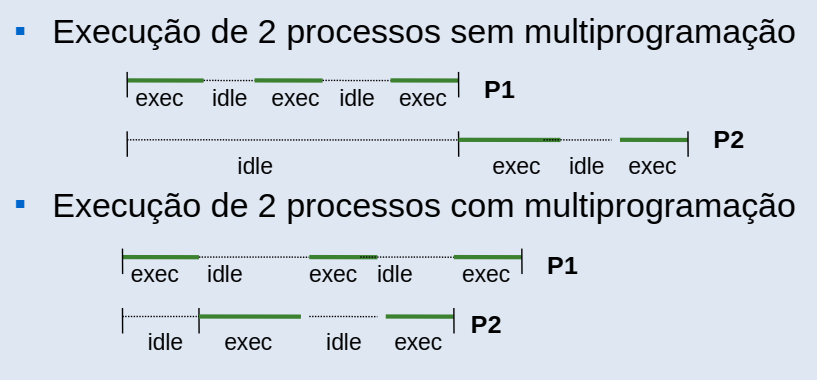

## Escalonamento de processos

a política de escalonamento varia de acordo com o propósito do SO, considerando
- prioridade

isso é implementado por uma heap de prioridade (à esquerda, os ids de processos de maior prioridade, à direita, os de menor). eventualmente, processos não prioritários aumentam de prioridade, pra que não sejam prejudicados ou nunca executem (starvation)

## Threads

threads são vantajosas pois compartilham memória de processo e agrupa recursos (espaço de endereçamento, arquivos abertos, etc.). porém, cada uma precisa do próprio PC, registradores, pilha, etc.

teoricamente, a sincronização de threads é semelhante à de processos: usamos locks, filas (heap de prioridade?), etc.

podemos ter processo 1:1 thread ou processo 1:n thread

por exemplo, em um servidor, podemos ter uma thread despachante que recebe dados pela rede e delega tarefas a outras threads operárias. caso uma thread operária precise acessar uma página na memória (não RAM), ela fica bloqueada esperando a transferênica da página pra RAM; nesse meio tempo, se chegar alguma nova requisição, a thread despachante pode alocar outra thread livre pra atendê-la

### Implementação

#### Threads no espaço de usuário

o núcleo (espaço de núcleo) tem apenas uma tabela de processos, os quais inicia e termina. cada processo pode ter uma tabela de threads (espaço de usuário)

problema: o SO não vê a nível de thread, então é possível ter o cenário em que um processo tem 3 threads e uma delas quer ler a memória; assim, o SO bloqueia o processo todo até que os dados requisitados estejam disponíveis, parando a execução

#### Threads no espaço de núcleo (kernel)

o núcleo controla tanto os processos quanto as threads diretamente, adicionando uma tabela de threads em espaço de núcleo, permitindo bloquear threads de um mesmo processo individualmente

desvantagem: o gerenciamento de threads é muito mais lento e custoso. processos precisam requisitar a criação de qualquer thread para o SO, que gasta muito mais tempo chaveando e sincronizando threads, manipulando uma tabela enorme de threads (o que também uma nova camada de complexidade para a tarefa do escalonador de garantir que todos os processos sejam atendidos)

#### Implementação híbrida

é possível um processo ter sua própria tabela de threads em espaço de usuário ou utilizar o sistema de threads do SO, fica a cargo da aplicação

### Escalonamento

Escalonamento em bando: threads mutuamente dependentes podem ser escalonadas juntas, pra que uma passe à seguinte um dado computado ou o acesso a um recurso compartilhado

dúvidas
- pq pode ser necessário ter mais de uma thread de controle?
- qual a desvantagem de threads em espaço de núcleo? o processo pede a criação de uma thread pelo núcleo? isso e a tabela unificada de threads em espaço de núcleo atrasam o gerenciamento?
- é mais rápido criar threads do que atualizar a memória alocada pro processo? como o acesso à memória é escalonada e intermediada pelo SO, pode demorar mais?
- os slides no aprender3 tão desatualizados?

```c
void* pthread_func() {
  /* ... */
  pthread_self(); // referência à própria thread
  pthread_exit();
}

int main() {

  for (i = 0; i < N ; i++) {
    id = (int *) malloc(sizeof(int));
    *id = i;
    pthread_create(&a[i], NULL, pthread_func, (void *) (id));
  }
  // alocar mem pra id e passar (void*) (id) garante que cada thread terá um id alocado em memória corretamente alinhado com i
  // caso passemos i, várias threads terão o mesmo id registrado (antes de atualizar i, a thread salvou i como seu id? doidera)
  // talvez seja mais rápido registrar threads no processo do que atualizar a memória do processo (escalonada e intermediada pelo SO)
  // além disso, o escalonamento de processos pode interromper a execução da main, que ainda ia atualizar i, mas coloca as threads t0, t1 e t2 pra executar suas primeiras instruções, para depois a pthread main atualizar i

  pthread_join(id, NULL);
  // espera as threads criadas terminarem, pois senão a thread mãe termina e mata todas as filhas
}
```

fonte: [criar_threads.c](examples/criar_threads.c)

meus testes de 10 pthreads em WSL Ubuntu (com esse código acima do Adilio):

código original compilado: \
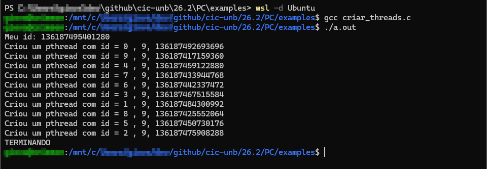

passando `i` como id das threads criadas, removendo `malloc()` para `int* id` e decrementando `c` em cada thread: \
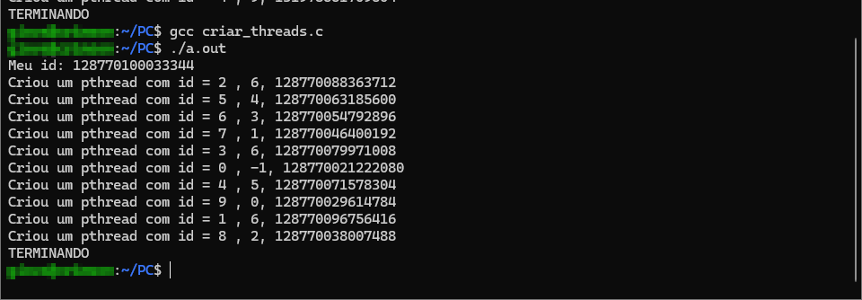

passando `i` como id das threads criadas e decrementando c em cada thread (com `malloc()`, mas sem usar `int* id`): \
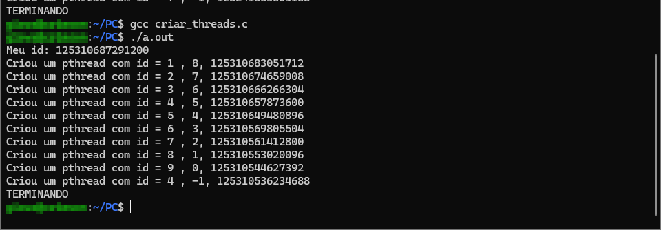

por algum motivo, as threads não repetem facilmente os ids passados incorretamente (passando a variável `int i` ao invés sem ser o `int* id` alocado). porém, `c` é sempre apresentado variando entre 7 e -1, ao invés de 9 a 0

talvez o WSL Ubuntu tenha alguma característica que acidentalmente sincroniza as threads. quando o prof testou, várias vezes havia 3 processos de id 0 e dois de id 2; quando outro colega testou, conseguiu todos as threads anunciando id 0


## Condição de corrida

há condição de corrida quando dois processos acessam dados compartilhados e o resultado final do processamento depende da ordem de execução deles

### Exclusão Mútua

garantir que não há dois ou mais processos competindo por recursos compartilhados. por exemplo, quando dados (necessariamente compartilhados) atualizados por dois processos na memória que precisam ser previsíveis e determinados em certo instante

### Região Crítica

parte do código em que é feito o acesso ao recurso compartilhado, ou seja, que pode levar a condições de corrida

se há duas threads que acessam uma mesma variável, os trechos que comandam esse acesso são regiões críticas "relacionadas". se uma thread está acessando uma região crítica e outra também tenta, essa segunda é bloqueada e só é liberada quando a primeira deixar a região crítica

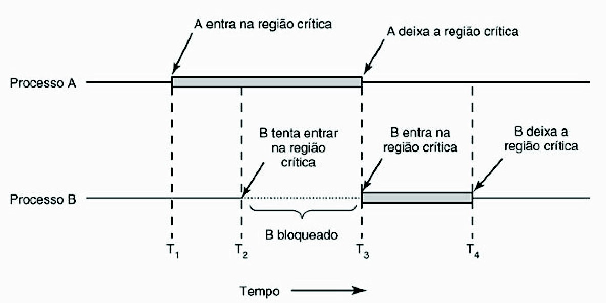

### Soluções para condições de corrida

- dois ou mais processos não podem estar simultaneamente em regiões críticas correspondentes
- nenhuma consideração pode ser feita sobre a velocidade relativa dos processos ou número de processadores disponíveis
- nenhum processo fora de sua região crítica deve interferir na execução de outro processo
- nenhum processo deve ser obrigado a esperar indefinidamente para entrar na sua região crítica

## Locks (travas)

mecanismo de sincronização pra que a execução de processos/threads concorrentes seja equivalente à sua execução serial (equivalência serial)

duas threads distintas têm o mesmo efeito quando suas operações retornam os mesmos valores finais

quando um lock é fechado, apenas aquele processo/thread pode ser executado; todo processo/thread fica bloqueado e deve esperar o lock ser aberto

podemos controlar o acesso à região crítica com um contador compartilhado ou uma flag (0 ou 1) indicando se há processos/threads que a acessam (acessam suas correspondentes àreas críticas), o que gera uma condição de corrida por si só, exigindo um lock pra sincronizar esses acessos


locks implementados por software: causam espera ocupada \
locks implementados por SO + hardware: não há espera ocupada -> ? os processos são engatilhados eficientemente?

mutex, futex (fast mutex)

precisamos declarar um lock antes de utilizá-lo

```c
pthread_mutex_t lock_contador = PTHREAD_MUTEX_INITIALIZER;

// ...

void* pthread_func(void* arg) {
  // ativar lock
  pthread_mutex_lock(&lock_contador);

  // processamento com exclusividade dessa thread
  // ...

  // liberar lock
  pthread_mutex_unlock(&lock_contador);
}

```

### Problema dos Escritores e Leitores

a escrita de um dado exige exclusão mútua, pois o dado é inconsistente/incompleto durante a escrita (mas podemos ter várias leituras independentes e paralelas)

- em alguns casos, basta garantir a exclusividade de execução do escritor
- banco de dados: escrita e leitura com exclusão mútua - se alguém lê, não deve haver escrita
  solução: o primeiro leitor fecha o lock de escrita e o último abre

  porém, precisamos garantir uma sincronização dos leitores pra saber qual é o primeiro, qual o último: lock de leitores

fonte: [leitores_escritores_mutex.c](examples/leitores_escritores_mutex.c)

```c
pthread_mutex_t db_write = PTHREAD_MUTEX_INITIALIZER;
pthread_mutex_t db_read = PTHREAD_MUTEX_INITIALIZER;
int reader_count = 0;

void* reader(void* arg) {
  int i = *((int *) arg);

  while (true)
    pthread_mutex_lock(&db_read);       // barra os demais leitores

      rc++;
      if (reader_count == 1)            // se for o primeiro leitor, fecha o lock de escritor
        pthread_mutex_lock(&db_write);  // se tiver escritor e &db_write estiver já fechado,
                                        // esse leitor fica bloqueado até o lock ser aberto

      pthread_mutex_unlock(&db_read);

      read_data_db(i);                  // leitura sem exclusão mútua entre leitores

      pthread_mutex_lock(&db_read);
        reader_count--;
        if (reader == 0)                // é o último leitor
          pthread_mutex_unlock(&db_read); // libera leitura às demais threads

    pthread_mutex_unlock(&db_write);

    use_data_read(i);
  }
}
```

problema: **starvation**, se tiver um alto fluxo de leitores, o lock de escritores pode nunca ser aberto \
solução: lock de leitores na escrita?, escalonamento de leitores e escritores? (talvez com uma política que favoreça levemente leitores)

tentativa 1: ecritores travam lock de leitores

pseudocódigo do fluxo das threads:
```
1. leitor:
  1.1 tranca pra leitores
  1.2 se for primeiro leitor: tranca pra escritores
  1.3 destranca pra leitores
  1.4 lê bd
  1.5 tranca pra leitores
  1.6 se for último leitor: destranca pra escritores
  1.7 destranca pra leitores

2. escritor:
  2.1 tranca pra leitores
  2.2 tranca pra escritores
  2.3 escreve
  2.4 destranca pra escritores
  2.5 destranca para leitores
```

nessa implementação ocorre deadlock! é possível que:
1. um leitor trave locks de leitores e escritores
2. um escritor fica bloqueado ao tentar travar lock de leitores, 
3. leitor destrava lock de leitores
4. escritor trava lock de leitores e fica travado pelo lock de escritores (indefinidamente)
5. leitor lê e fica bloqueado ao tentar travar lock de leitores (indefinidamente)

dúvida: quando uma thread quer abrir um lock aberto, fica bloqueada? provavelmente

solução correta: criar uma lock para turno

ao invés dos escritores travarem para leitores, eles travam a lock turno (garantem que é turno dos escritores) e travam lock de escritores (um por vez); e quando terminam, abrem a lock turno. quando o primeiro leitor quiser ler, trava lock turno (turno dos leitores), trava a lock de escritores (bloqueia escrita durante fluxo de leitores) síncronamente (lock de leitores, um por vez) e abre lock de escritores; o último leitor checa síncronamente se é o último e destrava a lock de escritores

pseudocódigo do fluxo das threads:
```
1. leitor:
  1.1 tranca turno
  1.2 tranca pra leitores
  1.3 se for priemiro leitor: tranca pra escritores
  1.4 destranca pra leitores
  1.5 destranca turno
  1.6 lê bd
  1.7 tranca pra leitores
  1.8 se for último leitor: destranca pra escritores
  1.9 destranca pra leitores

1. escritor:
  2.1 tranca turno
  2.2 tranca pra escritores
  2.3 escreve
  2.4 destranca pra escritores
  2.5 destranca turno
```

obs: na execução de leitor, é possível destrancar turno logo depois de trancar, em 1.2. o que importa é que a thread de escritor possa garantir sua execução entre fluxos de leitores sem ter conflito de locks de sincronização entre leitores. escritor já não executa durante fluxo de leitores, e também leitores ficam bloqueados por lock de turno quando escritor tenta escrever


### Problema dos macacos

há duas rochas, A e B, separadas por um penhasco e ligadas por uma corda

há um grupo de macacos em cada rocha e cada um quer atravessar para o outro lado. não é possível dois macacos de lados diferentes atravessarem ao mesmo tempo, mas vários macacos de um mesmo lado podem atravessar a corda no mesmo sentido

implemente um sistema de locks que permita que os macacos de um mesmo lado atravessem em grupo, sem atravessar ao mesmo tempo que um macaco do outro lado e sem starvation (os grupos se revezam)

solução: 

precisamos dos locks:
- lock_turno, pra garantir execução de uma thread/macaco - **evitar starvation**
- lock_corda, garantindo acesso exclusivo de um tipo de thread (grupo de macacos: macacoAB, macacoBA, gorilaAB, gorilaBA) - **área crítica de recurso compartilhado**
- lock_\<macaco\>, pra garantir sincronicidade do contador de cada tipo de macaco - **área crítica de variável compartilhada**

1. todo macaco tranca turno pra ter sua vez
2. todo início de fluxo de macaco tranca a corda, seja só um macaco/gorila ou um grupo de macacos
3. cada macaco que vai em grupo tranca as atualizações do seu respectivo contador de macacos

