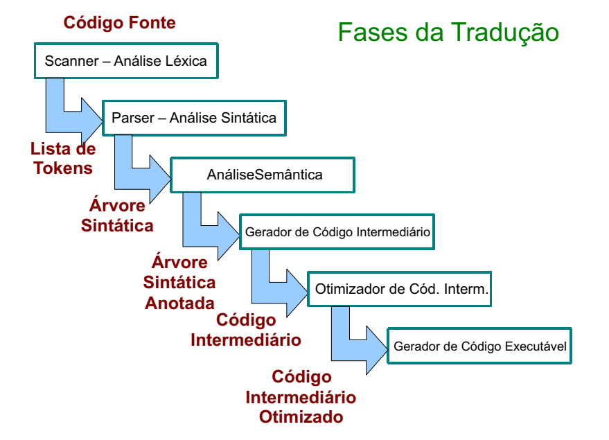
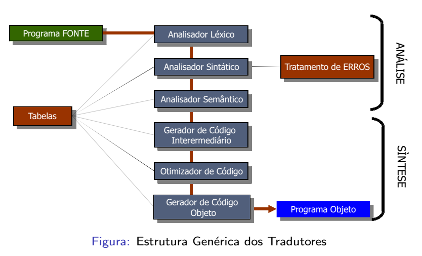
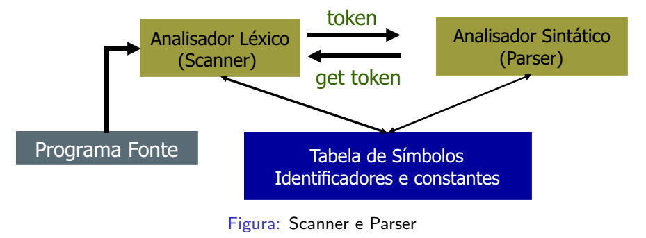
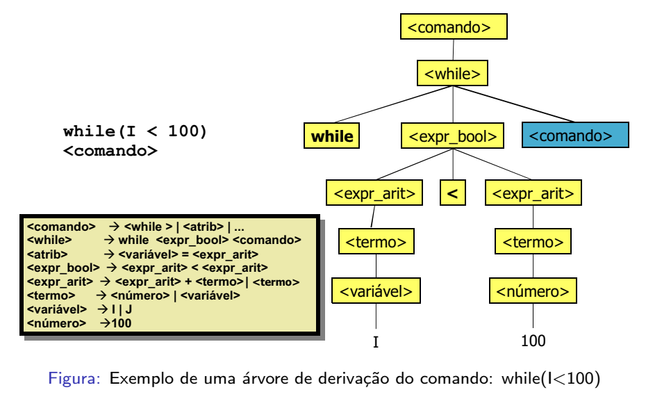
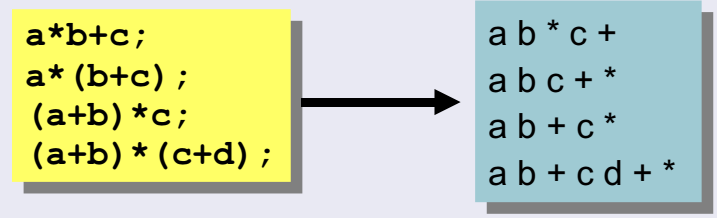
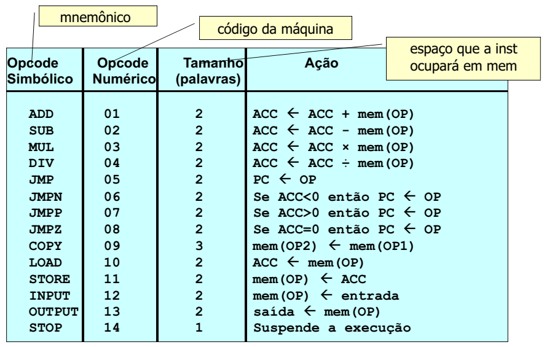
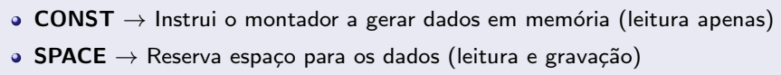

Software Básico

# Fases de compilação

Etapa de **análise**: decompõe o programa fonte e cira uma representação intermediária estruturada \
Etapa de **síntese**: constrói o programa objeto a partir da representação intermediária

token: unidade básica de informação para uma linguagem de programação \
ex: literal, função, operador, pontuação, palavra reservada, termo

| Fase                               | Causas de erro                                        |
| ---------------------------------- | ----------------------------------------------------- |
| Análise Léxica                     | impossível converter para tokens, erros de escrita    |
| Análise Sintática                  | erros de sintaxe (estrutura)                          |
| Análise Semântica                  | erros entre comandos/instruções (lógica, mal-tipagem) |
| Gerador de Código Intermediário    | a                                                     |
| Otimizador de Código Intermediário | a                                                     |
| Gerador de Código Executável       | a                                                     |

## Análise

### Análise Léxica (Scanner)

geralmente, subrotina do Parser para identificar novos tokens

identificar caracteres e agrupar em tokens (e ignorar comentários)
- palavras reservadas
- constantes/literais
- identificadores

construção da tabela de símbolos e cadeia de tokens

### Análise Sintática (Parser)

realizar varredura (parsing) na cadeia de tokens pra checar compatibilidade da estrutura gramatical do programa com as regras da linguagem
- reconhecer comandos e estruturas da linguagem
- construção de representação em Árvore de Derivação/Sintaxe
- em geral, aplicar desugaring

### Análise Semântica

verificações
- tipagem
- fluxo de controle
- unicidade da declaração de variáveis

produz:
- "conversões automáticas" de tipos (cast char/int, castings com warning)
- recebe a árvore de derivação e produz uma árvore anotada/semanticamente correta

## Síntese

### Geração de código intermediário

geralmente, são usados: código de três endereços e notação pósfixa (notação polonesa invertida)

#### Código de três endereços

linguagem independente de arquitetura em que toda expressão acessa no máximo 3 endereços (variáveis, operações, expressões)

dispõe de instruções:
- atribuição simples\
    `x := y`
- operações unárias e binárias\
    `x := y op z`, `x := op y`
- pulos condicionais e incondicionais\
    `goto _L`\
    `if x op y goto _L`

a implementação do código deve ser uma tabela com 3 colunas, uma representando um endereço:\
`a = b + c * d;`

tabela 1:1

| instr | operação | arg1 | arg2 | resultado |
| ----- | -------- | ---- | ---- | --------- |
| 1     | *        | c    | d    | _t1       |
| 2     | +        | d    | _t1  | a         |

tabela em código de três endereços

| instr | operação | arg1 | arg2 |
| ----- | -------- | ---- | ---- |
| 1     | *        | c    | d    |
| 2     | +        | d    | (1)  |

podemos omitir a coluna de resultados, pois o armazenamento e referenciação do resultado de cada instrução é responsabilidade do compilador. a instrução 2 utiliza o resultado (1) da instrução 1

#### Notação pósfixa

como é mais fácil implementar em hardware uma memória de pilha que uma memória de livre acesso de endereço, naturalmente a notação pósfixa permite implementações mais simples de hardware (e de alguma forma deve otimizar a execução)

#### Otimizações simples

obs: no início do desenvolvimento dos compiladores, não era possível otimizar qualquer programa para qualquer plataforma: a otimização era necessariamente ligada à arquitetura de um hardware específico, sendo necessário conhecer a implementação alvo para fazer qualquer otimização interna do código

1. garantir que duas expressões não fazem exatamente a mesma coisa\
    duas expressões não devem usar o mesmo operador sobre os mesmos argumentos (obedecendo restrições e exceções do hardware considerado)

2. garantir que, em todo loop, não haja instruções que independem do loop\
    essas instruções independentes são apenas executadas várias vezes e produzem o mesmo resultado, pois independe de qual iteração do loop ela é executada

    então podemos executá-las antes do loop

# Máquina de Turing Hipotética

obs: copy é a única instrução que não se implementa em assembly real, pois acessa duas

