Software Básico

# Fases de compilação

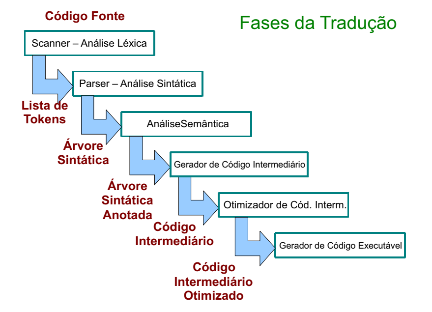

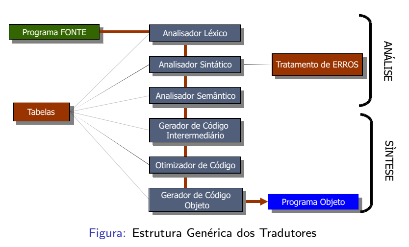

Etapa de **análise**: decompõe o programa fonte e cira uma representação intermediária estruturada \
Etapa de **síntese**: constrói o programa objeto a partir da representação intermediária

token: unidade básica de informação para uma linguagem de programação \
ex: literal, função, operador, pontuação, palavra reservada, termo


| Fase                               | Causas de erro                                        |
| ---------------------------------- | ----------------------------------------------------- |
| Análise Léxica                     | impossível converter para tokens, erros de escrita    |
| Análise Sintática                  | erros de sintaxe (estrutura)                          |
| Análise Semântica                  | erros entre comandos/instruções (lógica, mal-tipagem) |
| Gerador de Código Intermediário    | a                                                     |
| Otimizador de Código Intermediário | a                                                     |
| Gerador de Código Executável       | a                                                     |


## Análise

### Análise Léxica (Scanner)

geralmente, subrotina do Parser para identificar novos tokens

identificar caracteres e agrupar em tokens (e ignorar comentários)
- palavras reservadas
- constantes/literais
- identificadores

construção da tabela de símbolos e cadeia de tokens

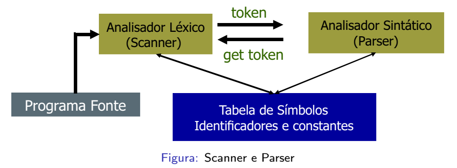

### Análise Sintática (Parser)

realizar varredura (parsing) na cadeia de tokens pra checar compatibilidade da estrutura gramatical do programa com as regras da linguagem
- reconhecer comandos e estruturas da linguagem
- construção de representação em Árvore de Derivação/Sintaxe
- em geral, aplicar desugaring


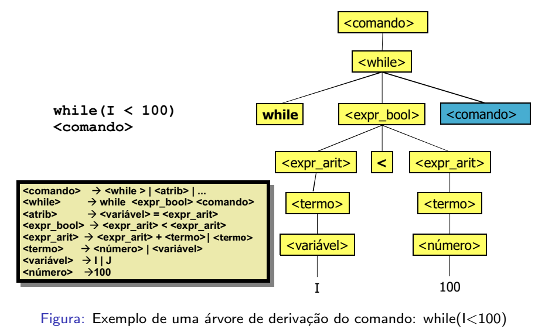

### Análise Semântica

verificações
- tipagem
- fluxo de controle
- unicidade da declaração de variáveis

produz:
- "conversões automáticas" de tipos (cast char/int, castings com warning)
- recebe a árvore de derivação e produz uma árvore anotada/semanticamente correta

## Síntese

### Geração de código intermediário

geralmente, são usados: código de três endereços e notação pósfixa (notação polonesa invertida)

#### Código de três endereços

linguagem independente de arquitetura em que toda expressão acessa no máximo 3 endereços (variáveis, operações, expressões)

dispõe de instruções:
- atribuição simples\
    `x := y`
- operações unárias e binárias\
    `x := y op z`, `x := op y`
- pulos condicionais e incondicionais\
    `goto _L`\
    `if x op y goto _L`

a implementação do código deve ser uma tabela com 3 colunas, uma representando um endereço:\
`a = b + c * d;`

tabela 1:1

| instr | operação | arg1 | arg2 | resultado |
| ----- | -------- | ---- | ---- | --------- |
| 1     | *        | c    | d    | _t1       |
| 2     | +        | d    | _t1  | a         |

tabela em código de três endereços

| instr | operação | arg1 | arg2 |
| ----- | -------- | ---- | ---- |
| 1     | *        | c    | d    |
| 2     | +        | d    | (1)  |

podemos omitir a coluna de resultados, pois o armazenamento e referenciação do resultado de cada instrução é responsabilidade do compilador. a instrução 2 utiliza o resultado (1) da instrução 1

#### Notação pósfixa

como é mais fácil implementar em hardware uma memória de pilha que uma memória de livre acesso de endereço, naturalmente a notação pósfixa permite implementações mais simples de hardware (e de alguma forma deve otimizar a execução)

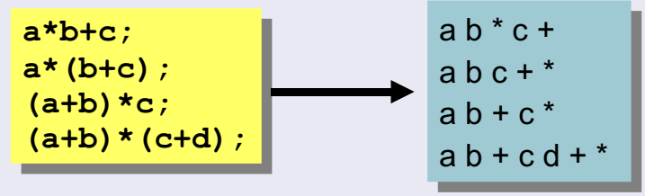

#### Otimizações simples

obs: no início do desenvolvimento dos compiladores, não era possível otimizar qualquer programa para qualquer plataforma: a otimização era necessariamente ligada à arquitetura de um hardware específico, sendo necessário conhecer a implementação alvo para fazer qualquer otimização interna do código

1. garantir que duas expressões não fazem exatamente a mesma coisa\
    duas expressões não devem usar o mesmo operador sobre os mesmos argumentos (obedecendo restrições e exceções do hardware considerado)

2. garantir que, em todo loop, não haja instruções que independem do loop\
    essas instruções independentes são apenas executadas várias vezes e produzem o mesmo resultado, pois independe de qual iteração do loop ela é executada

    então podemos executá-las antes do loop

#### Máquina de Turing Hipotética

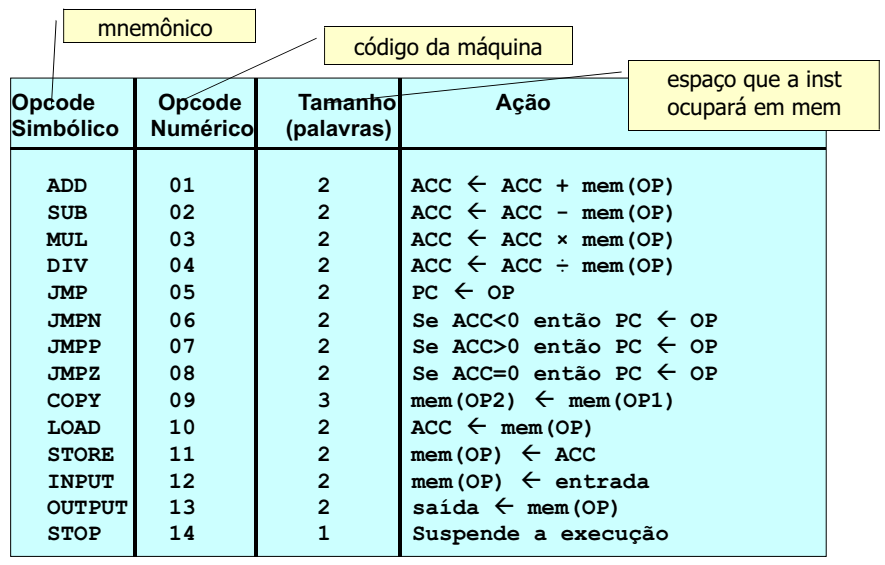

obs: copy é a única instrução que não se implementa em assembly real, pois acessa duas

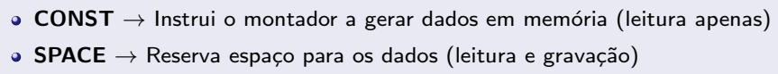

# Montador

nosso montador deve gerar um código (intermediário ou objeto) para nosso assembly inventado, realizando as tarefas:
- tradução de pseudo-instruções para opcodes e expansão de macros
- reserva espaço para dados
- resolver referências a endereços de memória no programa
- registrar informações para a ligação do programa
  - tabela de definições: símbolos externos utilizados no programa
  - tabela de uso: símbolos exportados e atributos

para isso, o montador deve percorrer o código fonte linha a linha para gerar o binário correspondente. é possível fazer isso em duas passagens ou uma única

hoje em dia, em geral, os compiladores usam apenas o algoritmo de duas passagens (a diferença de tempo costuma ser imperceptível para o usuário e deve adiantar processos de otimização)

*forward reference problem*: como resolver o endereço de um rótulo usado numa instrução sem ter chegado na definição do rótulo ainda?

## Algoritmo de duas passagens (two-pass assembler)

um símbolo é um rótulo ou nome de uma variável declarada

primeira passagem: identifica símbolos, rótulos, etc. e os armazena numa tabela de símbolos (TS)

segunda passagem: determina os endereços dos símbolos e gera código de máquina a partir da tabela

vamos utilizar:
- contador de linhas \
    indica linha do código fonte que está sendo analisada (para relatar erros)
- contador de posições \
    indica posição de memória no código a ser gerado
- tabela de símbolos (TS) \
    acumula todos os símbolos definidos e seus atributos
- tabela de diretivas \
    guarda definições de rotina de todas diretivas da linguagem

passos da 1ª passsagem:
1. obtém e decodifica linha do fonte, separando rótulo, operação, operandos, comentários
2. caso tenha rótulo: indica erro se já está definido; adiciona na TS caso não esteja definido
3. se operação estiver na tabela de instruções:
   1. atualizar contador de posição (+= tamanho da instrução atual)
4. senão, se operação estiver na tabela de diretivas:
   1. chama subrotina da diretiva
   2. atualiza contador de posição para o valor retornado pela subrotina
5. senão: erro de operação não identificada
6. atualizar o contador de linha (+= 1)

passos da 2ª passagem:
1. obtém e decodifica uma linha do fonte
2. para cada operando que é símbolo:
   1. se não estiver na TS: erro símbolo indefinido
3. procura operação na tabela de instruções:
   1. atualiza contador de posição (+= tamanho da instrução)
   2. se número e tipo dos operandos estão corretos: gera código objeto da instrução
   3. caso contrário: erro, operando inválido
4. senão:
   1. se estiver na tabela de diretivas:
      1. chama subrotina da diretiva
      2. atualiza contador de posulão para o valor retornado pela subrotina
   2. senão: erro, operação desconhecida
5. atualiza contador de linha (+= 1)

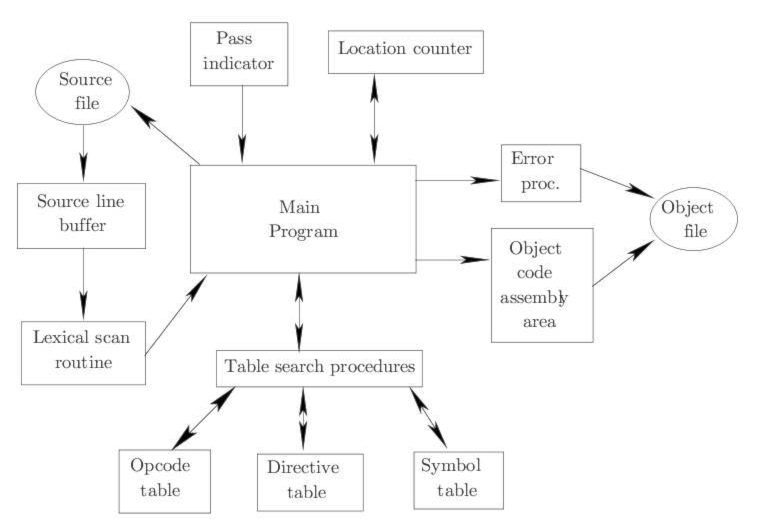

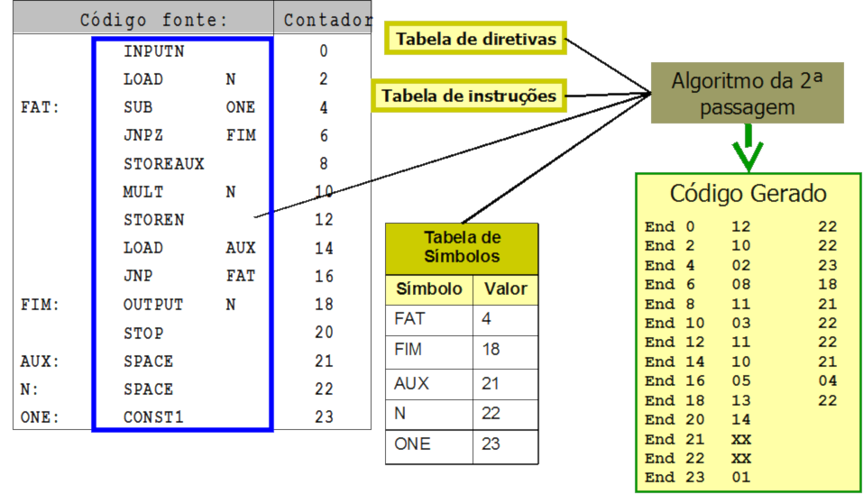

> [!note] obs:
> um program sempre vai começar em alguma posição específica da memória, então, o contador de posição do programa sempre vai iniciar no início da seção de memória reservada pra ele
>
> porém, podemos indicar as posições do código que contêm endereços (**informação de relocação**) e passar a tarefa de indicar o início correto do programa para o **carregador**, deixando em função do ponto de carga (relocação do programa)

vantagens:
- mais simples
- se todos os símbolos de uma instrução já estiverem definidos, seu código de máquina é gerado diretamente

desvantagens:
- toma mais tempo para leitura

## Algoritmo de passagem única

na passagem única, o montador insere um símbolo não definidos na tabela de símbolos, mas também guarda na tabela uma **flag** indicando se está **definido ou não** e um ponteiro para uma lista de endereços que referenciam esse símbolo (**lista de pendências**)

assim, para cada símbolo identificado:
- se não estiver na TS:
  - se for rótulo: adiciona na TS como definido e insere seu valor
  - se for referência: adiciona na TS como não definido e insere posição na lista de pendências
- se estiver na TS:
  - se está definido: insere seu valor no código gerado
  - senão: insere a posição atual na lista de pendências

ao final da passagem, o montador confere se todos os símbolos foram definidos. se sim, insere o valor de cada rótulo nas posições indicadas na sua respectiva lista de pendências; caso contrário, erro de símbolo não definido

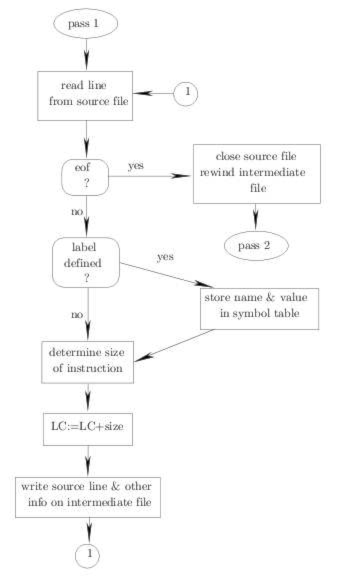

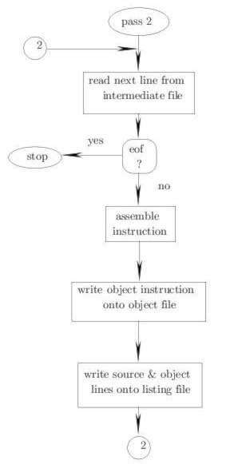

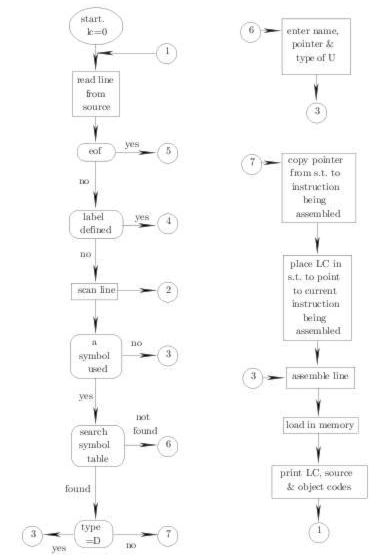

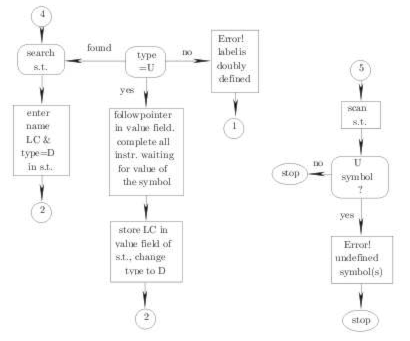

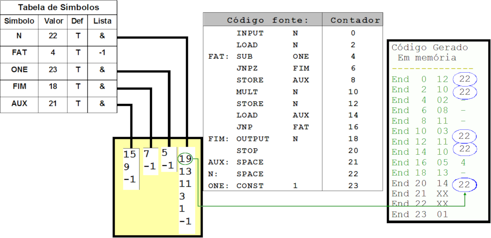

vantages:
- economiza em uma leitura completa do código fonte

desvantages:
- mais complexo
- gasta mais memória (flags, listas encadeadas)

## Algoritmo de indexação (no próprio código)


## Diretivas

diretivas são subrotinas para o montador executar. pode haver diretivas para qualquer passagem de um montador

passagem 0 ou passagem de pré-processamento: consideração de todas as diretivas de pré-processamento

- `SPACE (X)`: reserva o próximo endereço (opcionalmente, +X endereços seguintes a ele) 
- `+X`: soma um valor X ao endereço logo antes
- `ORG X`: define a posição do contador para as instruções a seguir \
  exemplo: definir segmento de texto e dados fixamente

  ```
  ORG 0
  <instruções>

  ORG 32768
  <variáveis>
  ```

- `[SIMB] EQU X` ("equate"): cria um sinônimo para um símbolo, semelhante a uma macro
- `IF [FLAG]` (*conditional assembly*): determina se uma instrução do código deve ser montada ou ignorada a partir do valor de uma flag
  ```
  FLAG EQU 1
  . . .

  IF FLAG
  JMP XXX     # se FLAG não é satisfeita, descarta a linha seguinte
  ```

  > [!note] obs:
  > a diretiva age apenas sobre a instrução logo abaixo

## MACROs

associam nomes a trechos de código. toda vez que o nome é referenciado no código, o montador deve substituí-lo pelo trecho de código definido. permite a definição de parâmetros e passagem de argumentos

traz um **custo maior de memória** do que chamar uma subrotina, mas costuma ser **mais rápido do que realizar essa chamada** (jump para a subrotina), executar esse código e retornar para o código principal (sem contar com a chance de empilhamento de dados em memória e desempilhamento ao final da subrotina, transferência de execução)

exemplo de definição de MACRO:

```
SWAP:   MACRO           # diretiva de definição de macro
        COPY A, TEMP
        COPY B, A
        COPY TEMP, B
        ENDMACRO        # diretiva de finalização de macro
```

como é meio inútil ter apenas macros com endereços fixos, as macros podem ser parametrizadas

```
SWAP:   MACRO &A, &B, &T    # vamos utilizar & pra denotar parâmetros
        COPY &A, &T
        COPY &B, &A
        COPY &T, &B
        ENDMACRO
```

Macro Name Table (MNT): contém linhas com os nomes de todas macros utilizadas e, opcionalmente
  - o número de argumentos que a macro usa
  - uma referência à linha em que a definição da macro se inicia na MDT
  - referência à última linha da definição da macro (desnecessário se a definição na MDT tem uma diretiva terminal de macro)

Macro Definition Table (MDT): guarda todas as definições das macros do programa

```
MNT                   |   MDT
linha 1: SWAP 3 25    |   linha 25: COPY #1, #3
                      |             COPY #2, #1
                      |             COPY #3, #2
                      |             ENDMACRO
```

os fluxogramas abaixo representam o pré-processamento considerando macros. pra adicionar os 

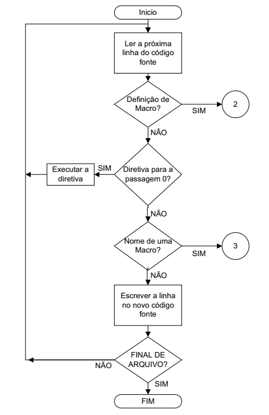

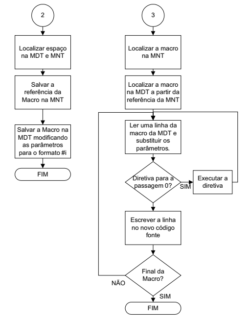

obs: no último passo do fluxograma acima partindo de 3, 

> [!note] observações:
> - tecnicamente, macros também são consideradas no pré-processamento. porém, como as passagens 0, 1 e 2 (a depender do montador) são sequenciais, é possível embutir a expansão de macros na passagem única ou na primeira das passagens (pelo que entendi do q o Bruno falou, é mais uma escolha de design, não é necessariamente mais ou menos otimizado)
> 
> - tipicamente, processadores exigem que macros sejam definidas antes de suas chamadas, permitindo que o processador de macros as expanda em uma única passagem pelo programa

## Fases de compilação do montador

toda linha do assembly inventado tem a estrutura:\
`<rótulo> : <operação> <operandos>; <comentário>`

considerando o algoritmo de duas passagens:
- a passagem 1 é mais próxima da fase de análise, identificando tokens e coletando símbolos do programa
- a passagem 2 é mais próxima da síntese, gerando um código intermediário/objeto correspondente ao fonte

## Acesso a memória (tabelas)

a maior parte do tempo gasto na montagem do programa é o acesso à memória (tabelas de instruções, diretivas e símbolos)

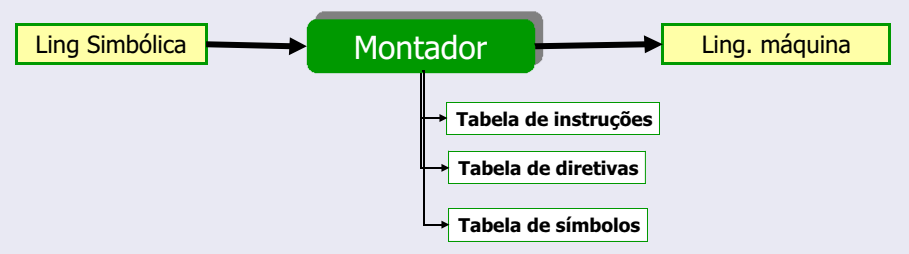

para otimizar esse acesso, precisamos ordernar esses recursos em estruturas de dados adequadas para busca rápida

- lista encadeada: \
  busca sequencial. tempo $\mathcal{O}(N)$; memória $\mathcal{O}(N)$\
  bastante simples, porém muito lento

- árvore binária: \
  busca binária. tempo $\mathcal{O}(\log_2(N))$; memória $\mathcal{O}(N)$ \
  ganho considerável de desempenho, mas **exige que a árvore esteja ordenada**

  | algoritmo      | caso médio         | pior caso                  |
  | -------------- | ------------------ | -------------------------- |
  | selection sort | $\mathcal{O}(N^2)$ | $\mathcal{O}(N^2)$         |
  | quick sort     | $\mathcal{O}(N^2)$ | $\mathcal{O}(N \log_2(N))$ |

- hash table: \
  busca por função hash. tempo $\mathcal{O}(1)$; memória $\mathcal{O}(1)$\
  ótimo para o desempenho, mas complexo (exige a estrutura de hash table, uma função de hash com controle de colisões)

  a função de hash recebe a chave (nome na tabela), gera um número e opera módulo nele (resultado idealmente único), retornando o endereço correspondente na tabela de hash. caso haja colisão de endereços, é formado uma lista encadeada dos resultados das chaves que colidem

  idealmente, a função é boa o suficiente pra distribuir os dados uniformemente e as listas possuem praticamente o mesmo tamanho

  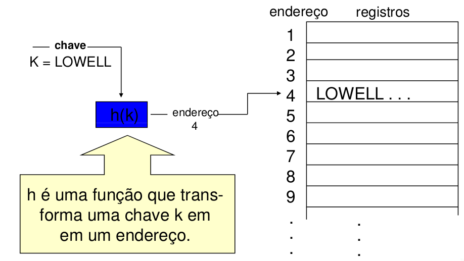

  por exemplo, numa tabela de hash de macros, usamos o nome da macro como chave da função

## Código relocável

para programas maiores, por conveniência, podemos montá-los e armazená-los em partes, para que sejam ligadas posteriormente, antes da execução

após a montagem, podemos indicar quais valores em são absolutos e quais são relativos (referenciam endereços que dependem de onde começa o programa)

abaixo, os valores com sufixo `a` são absolutos e com `r` são relativos (devem ser somados ao endereço inicial do programa)

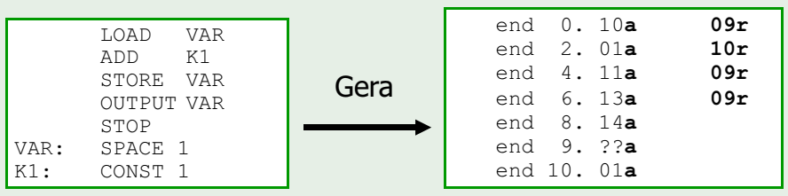

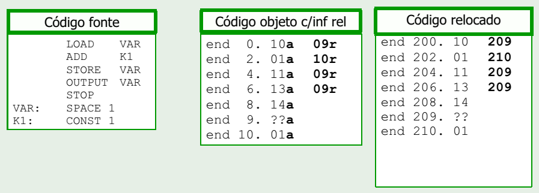

# Carregador

