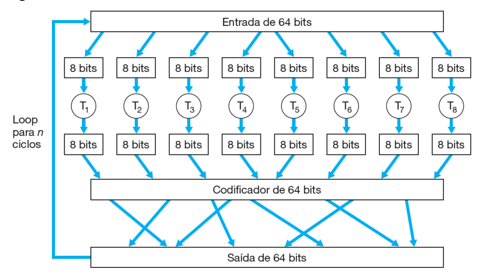
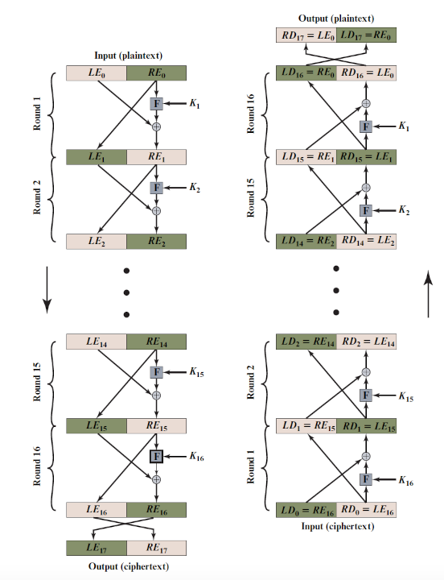
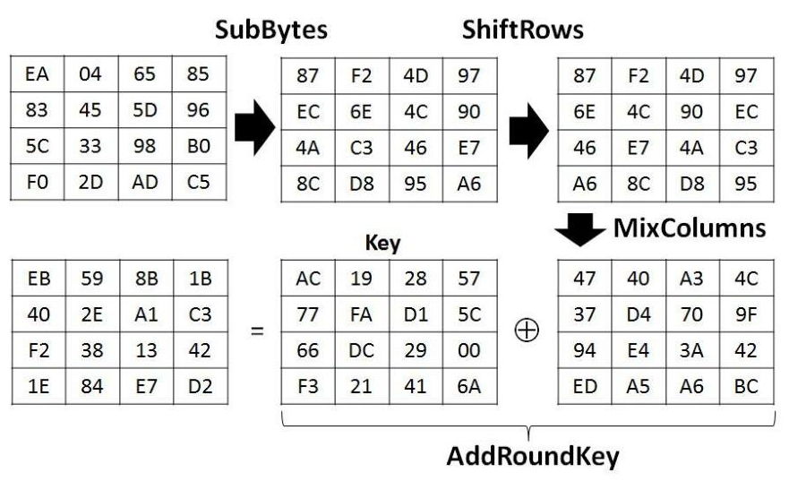
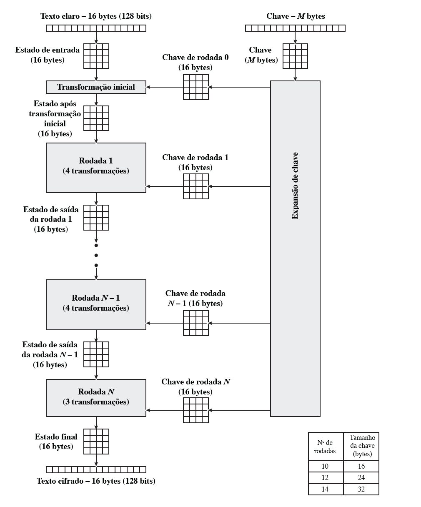
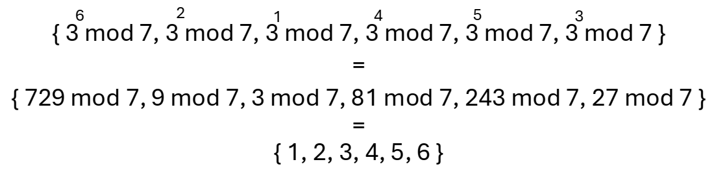
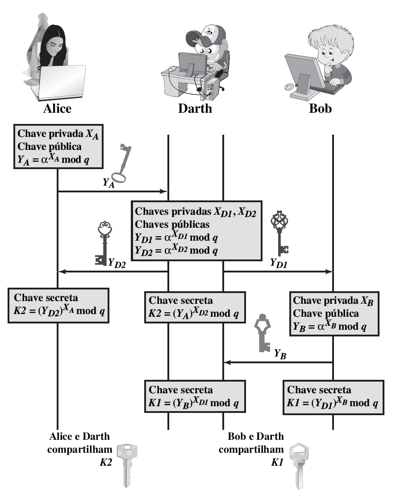

CIC0201 - Segurança Computacional

# Segurança

um serviço seguro tem algumas características garantidas:
- 3 pilares originais
    - **integridade**:  restringir acesso e preservar privacidade
    - **disponibilidade**: evitar alteração ou destruição indevida
    - **confidencialidade**: acesso confiável a sistemas
- outros que foram adicionados com o tempo:
    - **autenticidade**: validar identidade, origem, confiabilidade
    - **não-repúdio**: impede que uma entidade negue uma ação realizada
    - **responsibilidade (accountability)**: rastrear ações de entidades

essas garantias devem ser contempladas no hardware, software, dados, firmware e comunicação

Política: o que proteger (integridade, confidencialidade, e disponibilidade)
Modelo de ameaça (threat model): suposições (contra quem)
Mecanismo: software, hardware (implementa como proteger

# Ataques e proteção

Amigos
- Bob, Alice
Inimigos
- Trudy, Vanderlei

Ataques de inimigos
- **bisbilhotar/eavesdrop**: interceptar mensagens
- **inserir** ativimante mensagens na conexão
- **personificação/spoofing**: enviar mensagens se inserindo como remetente ou destinatário a nível de rede ou enlace (IP, endereço MAC)
- **sequestro/hijacking**: assumir uma sessão em andamento, substituindo o remetente ou destinatário 
- **negação de serviço/denial of service**: compromete a dispinibilidade do serviço

MAC addr, ARD protocol, requisição a nível de enlace

# Criptografia

para garantir a privacidade (e integridade) de uma mensagem, podemos criptografá-la, tranformá-la em outra representação que não pode ser lida por qualquer um, mas pode ser acessada em sua forma original pelo destinatário

para isso, podemos usar um algoritmo de criptografia que utiliza uma chave para mascarar e revelar uma mensagem. nesse modelo, faz sentido 

em geral, não vale a pena focar em segurança por ocultação. para que seja auditável, confiável e difundido faz sentido ter algoritmos públicos

## Criptografia simétrica

utilizamos apenas uma chave pra cifrar e descrifrar mensagens

podemos utilizar 

### Cifra de substituição

substituímos signos de uma mensagem

- Cifra de César (monoalfabética)

    mapeia as letras considerando um deslocamento uniforme pra cada uma. a chave K é o deslocamento utilizado pra cifra no alfabeto \
    C(plain_char + K) = encrypted_char \
    D(encrypted_char - K) = plain_char \
    |espaço de busca|: 26
    
    Cifra de César 2

    randomizo o mapeamento das letras \
    |espaço de busca|: 26!

    porém, nas duas cifras temos um problema: todas as letras são mapeadas para apenas uma, 
    
    ataque por análise de frequência -> descobrir qual o mapeamento de cada letra com base na frequência (mas também posição) em que ela ocorre nas mensagens

- Cifra de Vigenère (polialfabética)

    chave: uma palavra
    criptografia: alinha o texto plano com a chave repetida até que ocupe o mesmo número de caracteres, soma o índice do caractere original com o índice correspondente da chave repetida, soma os dois (mod 26) e o resultado é o índice do caractere cifrado

    tem chance da chave alinhar com uma letra específica (principalmente se for pequena), permitindo uma repetição na mensagem que corresponde a uma mesma letra, abrindo margem pra um ataque por ataque de frequência

espaço de busca: espaço de possibilidades para descobrir a cifra

### Cifra de Transposição

não transformamos os símbolos em si, mas reordenamos eles

podemos organizar os caracteres de um texto de 25 caracteres de em uma tabela 5x5, reordenamos as colunas da tabela, de forma que a chave é a nova ordem das colunas, e formamos de volta um texto linear cifrado, desordenado

### Cifra de Bloco

difusão: desorganização e despadronização dos dados
confusão: mapeamento aleatório

considerando um mapeamento aleatório de mensagens em bits (pra demonstrar espaço de busca)

| entrada | saída |
| ------- | ----- |
| 000     | 010   |
| 001     | 111   |
| 010     | 101   |
| 011     | 000   |
| 100     | 110   |
| 101     | 001   |
| 110     | 100   |
| 111     | 011   |

temos 8! tabelas possíveis para 3 bits
são (2k)! possíveis chaves caso seja possível mapear k bits para outros k bits aleatórios

se fosse possível escolher um k enorme, 64 por ex, teríamos um algoritmo quase totalmente aleatório e muito confuso, então seguro

1. divide 64 bits em blocos de 8
2. passa cada bloco por uma tabela de mapeamento aleatório
3. reordena os blocos entre si
4. repete o processo n vezes (ciclos/iterações)

porém, podemos ter repetições na mensagem, o que causa cifras repetidas. para evitar isso, podemos operar os blocos bit-a-bit com uma palavra binária aleatória do tamanho do bloco, mascarando as repetições após a criptografia

cifra = K(mensasgem op random)
c(i) = K(m(i) op r(i)) \
aqui, op é XOR

para não precisarmos criar uma palavra binária aleatória para cada bloco de uma mensagem, podemos utilizar a saída da operação do primeiro bloco com a primeira palavra aleatória (**vetor de inicialização**) como palavra aleatória pra operar com o próximo bloco

caso a entrada seja menor que 64 bits, aplicamos um padding: preenchemo-la (?) com lixo até que ocupe 64 bits

então, para descriptografar podemos precisar de:
- cifra
- vetor de inicialização
- padding (lixo adicionado, caso o tamanho da mensagem n seja múltiplo do tamanho de bloco)

#### Estrutura de Feistel

Difusão e Confusão
- queremos cifras que não transpareçam propriedades estáticas
- Difusão: aumentar a complexidade da relação entre texto cifrado e texto claro
- Confusão: aumenta a complexidade da relação entre texto cifrado e o
valor da chave

exemplo:
1. dividimos a entrada em 2
2. movemos a segunda metade para a nova primeira posição
3. pegamos a segunda metade e operamos $XOR$ com a chave da rodada $K_i$
4. passamos esse resultado na tabela de substituição
5. operamos a palavra substituída com a primeira metade
6. faz outras n rodadas idênticas, atualizando a chave da rodada
7. no final, **trocamos as metades** uma última vez

$S(X):$ passar X na tabela de substituição \
$F(R, K) = S(R \oplus K)$ \
$LE_{i+1} = RE_i$ \
$RE_{i+1} = LE_i \oplus F(R, K)$

#### Data Encryption Standard (DES)

- foi bastante utilizado, até ser quebrado em meados da década de 90
- ainda utilizado em hardware pelo baixo custo

implementação
- entrada de 64 bits
- chave de 56 bits
- 16 rodadas na rede de Feistel
- $F(R_i, K_i)$
    - expansão de 32 para 48 bits (repetimos determinados bits)
    - $XOR$ com subchave (da rodada)
    - passagem pelas S-boxes (não linearidade)
    - permitação final (mistura os bits)

obtenção da chave:
1. dividimos a entrada em blocos de 8 bits
2. para cada bloco, seu último bit é um bit de paridade, sobrando 7 bits efetivos de cada bloco (56 no total)
3. para cada rodada:
    1. passamos esses 56 bits pela tabela de substituição e temos a chave da rodada ($K_i, 1 \leq i \leq 16$)
    2. aplicamos um shift circular pra esquerda nos 56 bits (sem passar na tabela) para a próxima rodada

aplicamos a cifra na rede de Feistel. F():
1. dividimos a entrada de 64 bits em 2 metades de 32
2. aplicamos $F(RE_i, K_i)$, as operações $XOR$, etc.

#### Advanced Encryption Standard (AES)

- padrão pelo NIST (EUA), substituindo DES
- mais utilizado hoje em dia (Wi-Fi, HTTPS, VPNs, disc)
- baseado na "rede de substituição-permutação"

implementação
- blocos de 128 bits (16 bytes)
- cada bloco é processado em rodadas de transformação, a depender do tamanho da chave
    - AES-128 10 rodadas; AES-192 12 rodadas, AES-256 14 rodadas
- a cada rodada os blocos são: misturados, substituídos, embaralhados

s_box (constante de rodada): tabela que garante a variação da chave a cada rodada (aumenta difusão garantindo que elas não são linearmente dependentes?)

rodada:
- SubBytes: substituir byte através da s_box
- ShiftRows: aplica deslocamento à esquerda gradual em cada linha da matriz
- MixColumns: aplica uma multiplicação de matriz com a 
- AddRoundKey: aplica XOR entre subchaves

na primeira rodada: apenas AddRoundKey \
na última: não fazemos MixColumns

tabela de substituição s_box (fixa, uma para criptografar, outra pra descriptografar)

obtenção da subchave (exemplo)
- temos uma chave de 128 bits, 16 bytes/pares de caracteres hex
- separamos ela em uma matriz 4x4 (1 byte por posição), obtendo w[0], w[1], w[2] e w[3]
- para obter a próxima chave $i$, realizamos 4 operações:
    - deslocamento circular à esquerda em w[i-1]
    - substituir o resultado através da s_box

Rodada 0

Rodada 1
- SubByte: aplicar s_box
- ShiftRows: deslocar 1, 2, 3 bytes circularmente à esquerda
- 

#### side-channel attacks

pegar vazamentos de informação paralelos a um sistema. utilizar formas alternativas/periféricas pra obter algo de dentro do canal alvo

#### Abordagem Flush + Reload

temos um programa alvo e um programa atacante (que quer descobrir a chave privada de criptografia do sistema)

programa atacante executa um flush (s_box), limpando todas as referências da s_box em cache

logo em seguida, o programa atacante fornece um texto plano e pede ao programa alvo que o criptografe

logo que o processo do programa alvo tenta ler a s_box da memória, o processo do programa atacante requisita dados da s_box. os dados da s_box que tiverem uma resposta mais rápida devem ser os dados que já estavam na cache, atentendo ao processo alvo, e tem chance de serem referências da posição da tabela s_box

então, o programa atacante precisa sincronizar com as rodadas do AES, conseguir ter seu processo escalonado pra logo depois do processo alvo, ter chance de achar referências à posição na s_box (ao invés de lixo)

assim, o atacante tem
- o texto plano
- posições da s_box (das quais pode inferir as chaves de rodada) que pode usar pra montar a chave completa

hoje em dia, os SOs têm uma stack pra impedir essa chance, mas hardwares mais antigos tem mais chance de ser possível. pra replicar, é mais fácil remover proteções do kernel do sistema pra que seja possível e replicável

## Criptografia Assimétrica

### Criptografia de chave pública
Diffie-Hellman76, RSA78

- remetende e destinatário não compartilham chave secreta
- todos reconhecem a chave pública
- apenas o receptor tem a chave privada de decriptação de uma mensagem criptografada com a chave pública de criptação

precisamos de
- $K_B^-$ e $K_B^+$ tais que $K_B^-(K_B^+(m)) = m$
- dada chave pública K, é impossível obter a chave privada K

### RSA (Algoritmo de Rivest, Shamir, Adelson)

ganharam prêmio Turing pelo algoritmo

relembrando, $b/\Z_b$ é fechado para $+$, $-$, $\times$, $\div$
- $(a \mod n) + (b \mod n)] \mod n = (a+b) \mod n$
- $[(a \mod n) - (b \mod n)] \mod n = (a-b) \mod n$
- $[(a \mod n) * (b \mod n)] \mod n = (a*b) \mod n$
- $(a \mod n)^d \mod n = a^d \mod n$

### Diffie-Hellman 

#### Raiz primitiva (gerador) e logarítmo discreto

Conjunto resto módulo $p$: $\Z_p^* = \{ 1, 2, 3, ..., p-1 \}$

Para todo primo $p$, há um $g \in \Z_p^*$ gerador, ou raiz primitiva, tal que seja possível gerar todos os elementos de $\Z_p^*$ por potências de $g$

$\Z_p^* = <g> = \{ g^i \mod p | i \in \{ 0, 1, ..., p-1\} \}$

a operação de **logaritmo discreto** é: \
dado um $b = g^i \mod p$, $dlog_{g,p}(b) = i$, com $0 \le i \le p-1$

por exemplo, $dlog_{g,p}(4) = 4$, $dlog_{g,p}(1) = 3$, como mostrado acima

##### Procedimento

usuários A e B querem estabelecer uma chave simétrica num canal não seguro. para isso:
- compartilham um primo $q$ (idealmente 2048b) e uma raiz primitiva $g$ de $\Z_q^*$
- calculam "chaves públicas" e, com base nelas, forma-se uma chave simétrica útil apenas para os dois

Geração da chave simétrica:
1. A escolhe um número aleatório $X_A < q$, B um número aleatório $X_B < q$. $X_A$ e $X_B$ são secretos e não compartilhados
2. A calcula um número $Y_A \in \Z_q^*$, e B, $Y_B \in \Z_q^*$
3. ambos compartilham $Y_A$ e $Y_B$, que carregam propriedades matemáticas de $X_A$ e $X_B$
4. ambos geram uma mesma chave $K$: \
    para A, derivado de $X_A$ e $Y_B$; para B, $X_B$ e $Y_A$

    $K_A = (Y_B)^{X_A} \mod q$ \
    $K_B = (Y_A)^{X_B} \mod q$

    temos que $K_A = K_B$ pois
    
    $$(Y_B)^{X_A} \mod q \\ = (g^{X_B} \mod q)^{X_A} \mod q \\ = (g^{X_B * X_A} \mod q) \mod q \\ = (g^{X_A} \mod q)^{X_B} \mod q \\ = (Y_A \mod q)^{X_B} \mod q \\ = (Y_A)^{X_B} \mod q$$

**força**: o custo de $dlog_{g,q}$ é altíssimo, então é inviável tentar achar $X_A$ **e** $X_B$ \
**fragilidade**: sucetível a person-in-the-middle

quaisquer dois interlocutores podem combinar um conjunto resto p e um gerador. é possível se passar por um dos interlocutores alvo e se inserir entre a comunicação dos dois, enganando-os e fingindo que o atacante deve fazer parte da formação da chave

<!-- ### Elgamal -->
